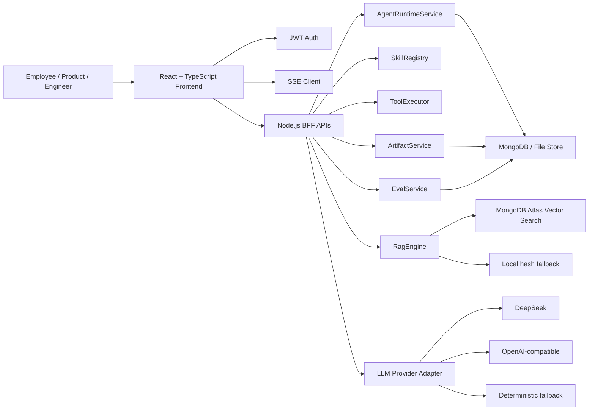
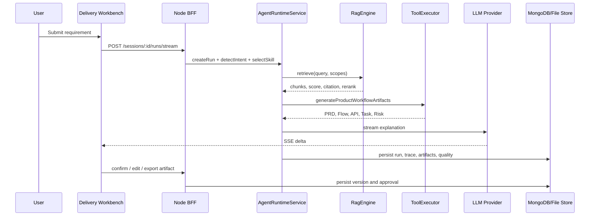

# AI Architecture Copilot

## RAG 检索链路：真实 LLM + 真实 Atlas Vector Search + 真实 Embedding

当前 `ailab-product-workflow` 分支的主 RAG 链路已经切换为真实链路，不再把本地 `local-deterministic` / `local-hash` 当作主路径。

```text
用户需求 / Query
  -> DashScope text-embedding-v3 生成 1024 维向量
  -> MongoDB Atlas Vector Search
     backend: mongodb-atlas
     index: chunks_vector_index
     path: embedding
     dims: 1024
  -> 返回 chunk / score / citation / sourcePath
  -> Skill-scoped Context Pack
  -> DashScope OpenAI-compatible LLM 流式生成
  -> Artifact / Trace / Eval / Approval
```

### 运行态验收

- `GET /api/agent-studio/blueprint` 的 `runtime.llm` 应显示 `provider=dashscope`、`mode=live`、`model=qwen-turbo`。
- `runtime.rag` 应显示 `backend=mongodb-atlas`、`retrievalBackend=mongodb-atlas-vector-search`、`embeddingProvider=dashscope`、`dimensions=1024`、`vectorSearchReady=true`、`productionReady=true`。
- Copilot 交付工作台顶部应显示 `live vector store · mongodb-atlas-vector-search · chunks_vector_index`。
- `local-hash-fallback` / `local-deterministic` 只作为降级路径保留；当 Atlas、索引或 embedding 调用失败时，前端必须明确展示 fallback 原因，不能伪装成 live。

### 关键配置

```env
LLM_PROVIDER=dashscope
LLM_MODEL=qwen-turbo
DASHSCOPE_API_KEY=...

RAG_BACKEND=mongodb-atlas
RAG_EMBEDDING_PROVIDER=dashscope
RAG_EMBEDDING_MODEL=text-embedding-v3
RAG_VECTOR_DIMENSIONS=1024
RAG_VECTOR_INDEX=chunks_vector_index
RAG_VECTOR_PATH=embedding
MONGODB_ATLAS_URI=mongodb+srv://...
MONGODB_DB_NAME=aidemo_dev
```

### 产品化意义

这条链路让 RAG 不再是“本地 hash demo”：检索结果来自 Atlas `$vectorSearch`，向量来自真实 embedding provider，回答过程能够展示真实 score、citation 和 sourcePath，并进入 Artifact、Trace、Eval 与人工确认闭环。

AI Architecture Copilot is an AI product delivery and AgentOps workbench for frontend architecture, AI application engineering, and internal R&D workflow automation.

It is not a generic chatbot. The project focuses on a concrete product scenario:

> Turn a business requirement into reviewable PRD, page structure, API contract, task breakdown, risk checklist, citations, trace, and human approval records.

The current branch `ailab-product-workflow` has converged on two primary product surfaces:

- **Copilot Delivery Workbench**: for business delivery, from requirement intake to artifacts.
- **AgentOps Console**: for runtime governance, audit, replay, approval, rollback, and quality evaluation.

Legacy Copilot / Agent modules are kept as debug and historical references, but the product direction is centered on the two workbenches above.

## Product Value

Modern AI applications should not stop at "chat with a model". In real R&D teams, AI output must be constrained, traceable, reviewable, and recoverable.

This project demonstrates a product-grade direction:

```text
Requirement
  -> Skill selection
  -> Knowledge scope
  -> RAG retrieval
  -> Tool calling
  -> Streaming generation
  -> Artifact versioning
  -> Human approval
  -> AgentOps audit and replay
```

Typical use cases:

- AI-assisted product requirement analysis.
- PRD, page structure, API contract, test strategy, and risk checklist generation.
- RAG-based internal knowledge reuse.
- Agent execution trace, tool-call audit, approval, rollback, and replay.
- AI product frontend architecture exploration.
- Team R&D efficiency workflow prototype.

## Current Feature Matrix

| Area | Current implementation |
|---|---|
| Frontend stack | React 19, TypeScript, Vite, Less |
| Backend stack | Node.js, Express, MongoDB / file fallback |
| Authentication | Password login for the restricted demo account, short-lived HttpOnly session, server-side revocation |
| LLM provider | DeepSeek / OpenAI-compatible / DashScope adapter with fallback status |
| RAG | Local hash fallback + MongoDB Atlas Vector Search adapter |
| Skill runtime | Skill definition, allowed tools, knowledge scopes, prompt contract |
| Tool calling | Knowledge search, repository analysis, artifact generation, product workflow generation |
| Streaming | SSE streaming, stop, retry, regenerate |
| Artifact system | PRD, page flow, API contract, task breakdown, test strategy, risk checklist |
| Artifact lifecycle | Preview, edit, copy, confirm, version record, export Markdown / JSON |
| AgentOps | Run registry, command center, state machine, trace timeline, tool audit, run detail, replay API |
| Human-in-the-loop | Approval, modification, rejection, review history |
| Eval | Scenario cases, citation hit, PRD completeness, API contract quality, trace replayability |
| MCP | Minimal stdio JSON-RPC MCP POC |

## Product Surfaces

### 1. Copilot Delivery Workbench

Path:

```text
/delivery-copilot
```

Positioning:

> A delivery-oriented AI workbench similar to Cursor / Copilot Workspace / Dify App Builder, but focused on product and frontend engineering artifacts.

Core user flow:

```text
1. Select a task mode or load an Eval Case
2. Enter business requirement, target user, delivery goal, constraints
3. Choose Skill and Knowledge Scope
4. Generate via SSE
5. Inspect citations and RAG debug result
6. Review structured artifacts
7. Confirm / edit / export artifacts
8. Send high-risk output to human approval
```

Main UI modules:

| Module | Responsibility |
|---|---|
| `SessionPanel` | Session list and active session switching |
| `SkillSelector` | Task mode, Skill, tools, and knowledge scope selection |
| `KnowledgeContext` | Vector store status, template packages, source documents |
| `RagDebugPanel` | Query, topK, score, chunk, rerank, filter reason, citation |
| `StreamPanel` | Streaming analysis process and generated answer |
| `ArtifactOverview` | Delivery status cards for PRD, Flow, API, Task, Risk |
| `ArtifactWorkbench` | Preview, edit, copy, confirm, export, versions |
| `TraceTimeline` | User-facing execution path |
| `ApprovalPanel` | Human approval state and review action |

The delivery workbench should feel like a real product workspace: it hides unnecessary debug noise, but preserves the evidence needed to explain how a result was produced.

### 2. AgentOps Console

Path:

```text
/agentops-console
```

Positioning:

> A runtime governance console inspired by LangSmith, LangGraph Studio, and AgentOps: it explains how an Agent ran, where it failed, and whether it can be recovered.

Core user flow:

```text
1. Enter command in Command Center
2. Select Agent / Skill / Knowledge Scope
3. Start Agent Run
4. Inspect Run Registry
5. Watch state machine transition
6. Expand Trace Timeline and Tool Call Audit
7. Open Run Detail drawer
8. Pause / resume / rollback / confirm / reject
9. Replay failed run
10. Review approval timeline and artifact archive
```

Main UI modules:

| Module | Responsibility |
|---|---|
| `CommandCenter` | Instruction input, agent selection, knowledge scope, run control |
| `RunRegistry` | Historical run list, status filtering, search |
| `StateMachinePanel` | Agent lifecycle visualization |
| `TraceAuditPanel` | Tool call audit, trace detail, token and latency |
| `RunDetailDock` | Selected run summary, artifacts, approval controls |
| `RunDetailDrawer` | Full run input, output, trace, sources, versions, logs |
| `RuntimeMetrics` | Latency, token usage, quality, baseline statistics |
| `RuntimeSummary` | Current runtime and provider status |

AgentOps is not another chat page. It is the operations layer for Agent systems.

## Architecture

### High-Level Architecture



### Runtime Sequence



### Agent Run Lifecycle

```text
idle
  -> validating
  -> intent_detected
  -> skill_selected
  -> retrieving
  -> tool_running
  -> streaming
  -> review_required
  -> confirmed
```

Failure and control paths:

```text
streaming -> failed
review_required -> paused
paused -> resumed
review_required -> rolled_back
failed -> replayed
review_required -> rejected
```

## Directory Structure

```text
.
├── client
│   └── src
│       ├── api
│       ├── components
│       ├── modules
│       │   ├── delivery-copilot
│       │   │   ├── DeliveryCopilot.tsx
│       │   │   ├── components
│       │   │   │   ├── ApprovalPanel.tsx
│       │   │   │   ├── ArtifactOverview.tsx
│       │   │   │   ├── ArtifactWorkbench.tsx
│       │   │   │   ├── KnowledgeContext.tsx
│       │   │   │   ├── RagDebugPanel.tsx
│       │   │   │   ├── SessionPanel.tsx
│       │   │   │   ├── SkillSelector.tsx
│       │   │   │   ├── StreamPanel.tsx
│       │   │   │   └── TraceTimeline.tsx
│       │   │   ├── types.ts
│       │   │   └── utils.ts
│       │   └── agentops-console
│       │       ├── AgentOpsConsole.tsx
│       │       ├── components
│       │       │   ├── CommandCenter.tsx
│       │       │   ├── RunDetailDock.tsx
│       │       │   ├── RunDetailDrawer.tsx
│       │       │   ├── RunRegistry.tsx
│       │       │   ├── RuntimeMetrics.tsx
│       │       │   ├── RuntimeSummary.tsx
│       │       │   ├── StateMachinePanel.tsx
│       │       │   └── TraceAuditPanel.tsx
│       │       ├── types.ts
│       │       └── utils.ts
│       ├── platform
│       └── styles.less
├── server
│   ├── src
│   │   ├── routes
│   │   │   ├── agentStudio.js
│   │   │   ├── auth.js
│   │   │   └── copilot.js
│   │   ├── services
│   │   │   ├── agentRuntimeService.js
│   │   │   ├── artifactService.js
│   │   │   ├── evalService.js
│   │   │   ├── llmProvider.js
│   │   │   ├── ragEngine.js
│   │   │   ├── skillRegistry.js
│   │   │   ├── sseParser.js
│   │   │   └── toolExecutor.js
│   │   ├── store
│   │   └── mcp
│   └── test
└── scripts
```

## Backend Service Boundaries

| Service | Responsibility |
|---|---|
| `agentRuntimeService` | Run lifecycle, state transition, replay, control patch, runtime summary |
| `skillRegistry` | Skill definitions, allowed tools, knowledge scopes, versioning |
| `toolExecutor` | Tool execution and structured artifact generation |
| `artifactService` | Artifact workflow, versioning, approval, export metadata |
| `evalService` | Quality score, checks, scenario scoring |
| `ragEngine` | Retrieval status, Atlas/local backend abstraction, rerank/filter reason |
| `llmProvider` | DeepSeek / OpenAI-compatible / DashScope / fallback streaming |
| `sseParser` | SSE framing/parser utilities |

The current `agentStudio.js` route still owns part of orchestration glue. The next engineering step is to make it a thin transport layer and move more runtime logic into service classes.

## API Overview

Authentication:

```text
GET  /api/auth/bootstrap
POST /api/auth/access/session
POST /api/auth/login              # development fallback only
GET  /api/auth/me
POST /api/auth/logout
```

Copilot / legacy runtime:

```text
GET  /api/copilot/runtime
GET  /api/copilot/vector-store/health
GET  /api/copilot/models
```

Agent Studio / product workbench:

```text
GET  /api/agent-studio/blueprint
GET  /api/agent-studio/sessions
POST /api/agent-studio/sessions
GET  /api/agent-studio/runs
GET  /api/agent-studio/runs/:id
POST /api/agent-studio/sessions/:id/runs/stream
POST /api/agent-studio/runs/:id/control
POST /api/agent-studio/runs/:id/review
POST /api/agent-studio/runs/:id/replay
PATCH /api/agent-studio/runs/:id/artifacts/:artifactId
POST /api/agent-studio/runs/:id/artifacts/:artifactId/confirm
GET  /api/agent-studio/runs/:id/artifacts/:artifactId/export?format=markdown
GET  /api/agent-studio/runs/:id/artifacts/:artifactId/export?format=json
GET  /api/agent-studio/eval-cases
POST /api/agent-studio/eval-cases/:id/score
```

## RAG Design

The RAG layer is intentionally explicit about live / fallback state.

Supported modes:

| Mode | Description |
|---|---|
| `mongodb-atlas` | Uses MongoDB Atlas Vector Search when configured and healthy |
| `local-hash` | Local deterministic embedding fallback, used for offline demos |

RAG response should expose:

- query
- topK
- document title
- chunk content
- score
- rerank score
- rerank strategy
- filter reason
- citation
- retrieval backend

This is important because AI product users need to know why a source was selected, not just see a final answer.

### MongoDB Atlas Vector Search

Example `.env`:

```bash
RAG_BACKEND=mongodb-atlas
MONGODB_ATLAS_URI=mongodb+srv://<user>:<password>@<cluster>/?retryWrites=true&w=majority
MONGODB_DB_NAME=aidemo_dev
RAG_VECTOR_INDEX=chunks_vector_index
RAG_VECTOR_PATH=embedding
RAG_VECTOR_DIMENSIONS=96
RAG_CREATE_VECTOR_INDEX=false
```

Atlas Vector Search index example:

```json
{
  "fields": [
    {
      "type": "vector",
      "path": "embedding",
      "numDimensions": 96,
      "similarity": "cosine"
    },
    {
      "type": "filter",
      "path": "scope"
    }
  ]
}
```

Health check:

```bash
npm run vector:health
```

Seed and check:

```bash
npm run vector:health -- --seed
```

The UI must not hide fallback. If Atlas is unavailable, the interface should show local fallback and the exact reason.

## LLM Provider

DeepSeek:

```bash
LLM_PROVIDER=deepseek
DEEPSEEK_API_KEY=sk-xxx
LLM_MODEL=deepseek-chat
```

OpenAI-compatible:

```bash
LLM_PROVIDER=openai-compatible
LLM_BASE_URL=https://your-provider.example.com/v1
LLM_API_KEY=sk-xxx
LLM_MODEL=your-model
```

DashScope:

```bash
LLM_PROVIDER=dashscope
DASHSCOPE_API_KEY=sk-xxx
LLM_MODEL=qwen-plus
```

Runtime status should show:

- provider
- model
- live / fallback
- streaming support
- error reason

## Local Development

Install:

```bash
npm install
```

Start local MongoDB:

```bash
npm run mongo
```

Start app:

```bash
npm run dev
```

Open:

```text
Frontend: http://127.0.0.1:5173
Backend:  http://127.0.0.1:4000
Health:   http://127.0.0.1:4000/health
```

Create a private local `.env` before starting. The committed defaults do not
create a shared administrator account:

```env
PASSWORD_LOGIN_ENABLED=true
LEGACY_BEARER_ENABLED=false
SEED_DEMO_ADMIN=false
```

If a development administrator must be bootstrapped, set
`SEED_DEMO_ADMIN=true`, `DEMO_ADMIN_EMAIL` and `DEMO_ADMIN_PASSWORD` only in
the ignored local `.env`, start the service once, then immediately restore
`SEED_DEMO_ADMIN=false`. Never publish shared login credentials in source,
documentation, images or deployment logs.

`.env.example` is a committed template and is never loaded directly. Copy the
required values into the untracked root `.env`. With `RAG_BACKEND=mongodb-atlas`,
the account is created in the database selected explicitly by
`MONGODB_DB_NAME`. Development defaults to `aidemo_dev`, tests use
`aidemo_test`, and production must explicitly set `aidemo_prod`. The runtime
writes an environment marker into each database and refuses to start when the
marker does not match `NODE_ENV`.

Atlas application credentials are isolated too. Development uses a username
ending in `_dev_app`, production uses `_prod_app`, and production requires
`MONGODB_EXPECTED_USERNAME` to match the connection URI username. The server
refuses to start when its production identity has `atlasAdmin`,
`readWriteAnyDatabase`, or another cluster-wide administrative role. Run
`scripts/provision-atlas-environment-users.sh` with an authenticated Atlas CLI
to create database-scoped identities.

To copy legacy data from `growth_ai_assistant` into the current environment
database, preview and then apply the idempotent migration:

```bash
npm run database:migrate --workspace server -- --source growth_ai_assistant
npm run database:migrate --workspace server -- --source growth_ai_assistant --apply
```

There are no usable credentials in the repository. Production must set
`PASSWORD_LOGIN_ENABLED=false`, `LEGACY_BEARER_ENABLED=false`, and
`SEED_DEMO_ADMIN=false`.

## Public Interview Demo Authentication

The production demo uses the existing restricted application account:

```text
Visitor email and password
  -> existing users collection (`demo_viewer`)
  -> dedicated tenant-interview-demo
  -> short-lived HttpOnly/Secure/SameSite cookie
  -> existing Session / Run / Artifact / Trace APIs
```

Required deployment steps:

1. Add the Aliyun DNS record `app.agentdelivery.asia -> 8.217.153.138`.
2. Allow TCP 80/443 and restrict SSH port 22 to the operator's IP.
3. Set `CLIENT_ORIGIN(S)=https://app.agentdelivery.asia`, enable password login,
   keep `SEED_DEMO_ADMIN=false`, and deploy through `deploy/docker-compose.prod.yml`.
4. After the interview, revoke the demo account. Existing cookies can be invalidated
   immediately by incrementing `tokenVersion` or setting `disabledAt`.

`deploy/deploy.sh` performs one DNS-to-ECS check before Caddy requests the certificate.

Immediate application-side revoke/enable commands (run with production env loaded):

```bash
npm run access:manage --workspace server -- --action revoke --email interviewer@example.com
npm run access:manage --workspace server -- --action enable --email interviewer@example.com --expires-at 2026-08-12T12:00:00+08:00
```

`demo_viewer` can read its tenant data, create sessions, search permitted knowledge,
and start a limited number of Demo Runs. Knowledge import/upload, artifact mutation,
approval, replay/control, export, and tenant switching are denied by the API—not
merely hidden in the UI. The current limiter is designed for the documented
single-ECS deployment; use a shared Redis limiter before horizontal scaling.
Rejected demo mutations and tenant-switch attempts are persisted as
`security.authorization.denied` telemetry containing actor, tenant, route,
method, result code, IP and user agent. Request bodies, cookies, authorization
headers and tokens are deliberately excluded.

Quality commands:

```bash
npm run lint
npm run typecheck
npm run test:server
npm run verify
```

## Testing Scope

Current server tests cover:

- SSE parser
- Skill registry
- Tool executor
- Artifact workflow
- Eval scoring
- Agent runtime service

The next testing focus:

- Agent control error paths
- Replay chain consistency
- Artifact version diff
- RAG retrieval fallback behavior
- Frontend interaction tests for streaming, approval, and export

## Product Maturity

Current status:

| Dimension | Status | Notes |
|---|---|---|
| Product flow | Good | Delivery and AgentOps surfaces are separated |
| Frontend architecture | Good, improving | New workbenches are componentized; legacy files remain |
| Backend architecture | Medium | Services exist; route layer still has orchestration glue |
| RAG credibility | Medium | Atlas adapter exists; live deployment depends on env and Atlas index |
| Agent runtime | Medium | State, trace, approval, replay exist; stronger durable state machine needed |
| Artifact lifecycle | Medium-high | Preview/edit/confirm/export/version exist; stronger diff and association needed |
| Eval | Medium | Scoring exists; needs regression dataset and repeated-run stability |
| UI product quality | Medium-high | Core layout improved; still needs systematic visual QA |

## Roadmap

### P0: Credibility and product closure

- Keep only two primary product routes in navigation: Delivery Workbench and AgentOps Console.
- Ensure Atlas Vector Search health is visible and honest.
- Persist Artifact status, versions, approvals, exports.
- Link Artifact with Trace, Source, Eval.
- Make Eval score real: citation hit, PRD completeness, API quality, trace replayability.
- Finish visual QA for 1440 and 1920 widths.

### P1: Engineering productization

- Continue frontend module decomposition.
- Make `agentStudio.js` a thin route layer.
- Move orchestration into `agentRuntimeService`.
- Add tests for SSE parser, Skill schema, Artifact lifecycle, Agent control, replay.
- Upgrade RAG Debug with rerank and filter reason.
- Add Run Detail drawer, failure replay, state transition graph.

### P2: Open platform

- Connect GitHub repository data: README, issue, PR diff, source files.
- Make MCP part of the main tool runtime.
- Add eval dataset and CI quality gate.
- Add public demo mode with limited token usage.
- Publish technical articles on AI product frontend architecture, Agent Trace, and RAG Eval.

## Design Principles

- **Task-first, not menu-first**: users describe the job to be done.
- **Artifact-first, not chat-only**: useful AI output becomes managed assets.
- **Trace-first, not black box**: every action has source, tool, token, latency, and status.
- **Human-in-the-loop by default**: high-risk outputs require review.
- **Fallback is visible**: local fallback is allowed, but never disguised as live AI.
- **Frontend owns AI UX**: streaming, cancellation, retry, source linking, approval, and replay are product features, not decoration.

# Agent Runtime 状态机服务化

> 状态：基本完成（commit `38e0096`）。再修 `server/src/routes/agentStudio.js:784` 一处重复直写即可视为 100% 收口。

## 已实现

Agent Run 的状态迁移已从路由层下沉为统一的服务化事件日志，所有合法迁移都经过 `applyTransition()` 校验、生成事件并原子落库。

| 能力 | 实现位置 | 说明 |
|---|---|---|
| 状态迁移表 | `server/src/services/agentRuntimeService.js:3-20` | `none → created → intent_detected → skill_selected → retrieving → tool_running → streaming → review_required → confirmed/rejected/rolled_back` 全链定义 |
| 迁移合法性校验 | `agentRuntimeService.js:52-55` | `canTransition(from, to)`，非法迁移抛 409 |
| 事件对象构造 | `agentRuntimeService.js:57-68` | `createStateTransition()` 生成带 `id/from/to/label/actorId/reason/at/meta` 的事件 |
| 统一落库入口 | `agentRuntimeService.js:84-97` | `applyTransition(store, run, to, {...})` = 校验 + 事件 + 原子 `store.updateRecord` 三合一 |
| SSE 主链路接入 | `server/src/routes/agentStudio.js:613-625` | `emitStatus()` 内部调用 `applyTransition`，`:633/:643/:654/:674/:695/:761` 全部走该入口 |
| 运行控制接入 | `server/src/routes/agentStudio.js:445-449` | `/runs/:id/control` 的 pause/resume/rollback/cancel 走 `applyTransition` |

## 验证证据

一次完整 Run 的 `stateTransitions` 数组已完整包含：

```text
none → created → intent_detected → skill_selected → retrieving → tool_running → streaming → review_required
```

下图为实际 Run 的状态事件链，证明上述迁移在 `38e0096` 已真实落库、可被前端读取展示：


（截图来自 AgentOps 控制台的 Run Detail，可见 7 个连续状态事件，均带时间戳与触发原因。）

## 收尾待办（唯一缺口）

`server/src/routes/agentStudio.js:784-801` 非流式分支在生成 Run 时直接写了：

```js
const run = await persistRun({
    status: 'review_required',
    prompt,
    intent,
    // ...
});
```

但 `:761` 已经通过 `emitStatus('review_required', ...)` 完成迁移并落库，此处 `status` 直写属于**重复绕过统一入口**。修复方式：删除 `:784` 这次 `persistRun` 里的 `status: 'review_required'`，仅保留 `quality / evalResult / artifacts` 等业务字段即可。

> 人工审批路由（`:276-296`）使用 `transitionRunPatch` + 手动 `store.updateRecord`，功能正确，仅风格不一，可后续统一为 `applyTransition`，不阻塞收口。

## 这样做的好处

1. **可审计** —— 每个迁移都记录 `actorId`（谁）、`reason`（为什么）、`at`（何时）、`meta`（上下文），天然形成审计日志。
2. **可回放** —— `createReplayRunDraft()` 已把原 Run 的 `stateTransitions` 整体带出，失败回放能复现完整状态链。
3. **防非法迁移** —— `canTransition` 在后端拦截 `confirmed → retrieving` 这类乱迁，返回 409，而非静默写坏数据。
4. **并发安全** —— `applyTransition` 内部为单次原子 `store.updateRecord`，避免多客户端并发改 `status` 导致状态冲突。
5. **路由只发指令** —— `agentStudio.js` 不再自己拼 `status + stateTransitions`，业务规则下沉到 service。
6. **为 P2 打底** —— 后续「谁对 Run 做了什么」「SLA 耗时」「失败率统计」「权限审计」均可直接消费 `stateTransitions` 事件流，无需返工补埋点。
