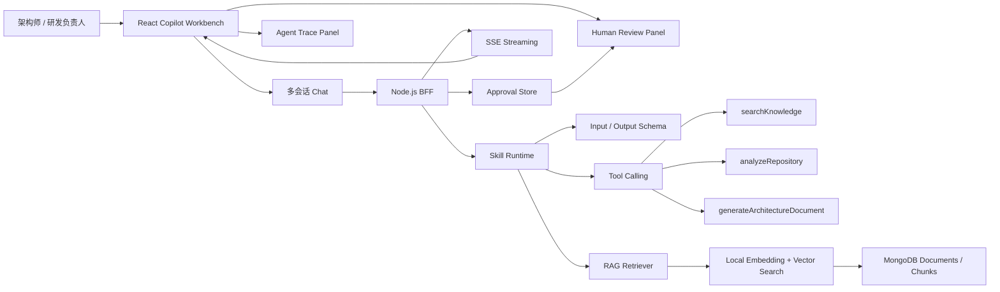

# AI Architecture Copilot

`mvp` 分支是基于 1.0 基线切出的架构 Copilot 版本。它把原有平台能力收敛成一个面向架构师和研发团队的 Agent 工程系统，用来展示多会话 Chat、Skill Runtime、Tool Calling、轻量 RAG、人工确认和 Agent Trace。

## 快速启动

```bash
npm install
npm run mongo
npm run dev
```

访问：

- 前端：http://127.0.0.1:5173
- 后端：http://127.0.0.1:4000
- 健康检查：http://127.0.0.1:4000/health

登录账号：

```text
admin@growth.ai
demo123456
```

## MVP 必备功能

### 1. 多会话 AI Chat

已实现：

- 多会话创建和历史切换。
- SSE 流式输出。
- Markdown 渲染。
- 代码块高亮。
- 会话历史持久化到 MongoDB/FileStore。
- 停止生成：前端 AbortController 中断流式请求。
- 重新生成：复用最近一条用户消息重新发起生成。

入口文件：

- `client/src/modules/copilot/CopilotWorkbench.tsx`
- `server/src/routes/copilot.js`

### 2. Skill 系统

内置 3 个 Skill：

- 需求分析 Skill：拆解目标、约束、验收标准和风险。
- 架构评审 Skill：审查前端架构、BFF、RAG、Agent、可观测性和发布风险。
- 代码审查 Skill：关注 PR 风险、测试缺口、性能和工程规范。

每个 Skill 都符合以下结构：

```ts
type SkillDefinition = {
  id: string;
  name: string;
  description: string;
  systemPrompt: string;
  inputSchema: JSONSchema;
  outputSchema: JSONSchema;
  allowedTools: string[];
  knowledgeScopes: string[];
  version: string;
};
```

设计重点：

- 输入约束：用 `inputSchema` 描述必填字段和类型。
- 输出约束：用 `outputSchema` 约束结构化结果。
- 可用工具：每个 Skill 只能调用 `allowedTools` 中的工具。
- 知识范围：RAG 检索按 `knowledgeScopes` 选择上下文。
- 版本管理：Skill 带 `version`，便于灰度、回滚和审计。

### 3. Tool Calling

MVP 内置 3 个普通函数工具，接口设计保持可迁移到 MCP Server：

- `searchKnowledge`：按 Skill 的 knowledgeScopes 检索研发知识库。
- `analyzeRepository`：分析当前工程栈、模块和风险。
- `generateArchitectureDocument`：生成 Markdown 架构文档草稿。

工具调用结果会进入 Agent Trace，包括：

- Tool 名称。
- 输入参数。
- 输出摘要。
- 耗时。
- token 使用量。
- 错误信息。

### 4. 轻量 RAG 知识库

已实现：

- 上传 Markdown、TXT、PDF。
- 文档切分。
- 本地 embedding。
- 向量检索。
- 回答展示引用来源。
- 根据 Skill 限定知识范围。

MVP 种子知识包括：

- 微前端设计文档。
- SDK 规范。
- IM 架构文档。
- 低代码组件协议。
- 项目开发规范。

说明：

- Markdown/TXT 直接读取文本。
- PDF 在 MVP 中支持上传和元数据入库；生产环境可接 PDF parser 抽取正文。
- 当前向量检索使用本地 hash embedding，后续可替换为 Milvus、pgvector 或 Pinecone。

### 5. 人工确认节点

AI 生成架构建议后会进入暂停状态：

- 用户确认。
- 用户修改。
- 用户拒绝。
- 修改后继续生成最终文档。

接口：

```text
POST /api/copilot/approvals/:id/confirm
POST /api/copilot/approvals/:id/revise
POST /api/copilot/approvals/:id/reject
```

约束：

- 写文件、改配置、发请求等高风险动作不能自动执行。
- 高风险工具必须进入人工确认。
- 审批结果必须保存，便于 Trace 和审计。

### 6. Agent Trace 面板

右侧 Trace 面板展示完整执行轨迹：

```text
用户请求
→ 选择 Skill
→ 加载上下文
→ 调用知识库
→ 调用工具
→ 生成结构化结果
→ 等待人工确认
→ 输出最终文档
```

每一步展示：

- 状态：running / success / waiting / failed。
- 耗时。
- Tool 输入输出。
- token 使用量。
- 错误信息。
- 是否需要人工确认。

## 架构设计



## API 设计

```text
GET  /api/copilot/skills
GET  /api/copilot/sessions
POST /api/copilot/sessions
GET  /api/copilot/sessions/:id
POST /api/copilot/sessions/:id/messages/stream
GET  /api/copilot/knowledge
POST /api/copilot/knowledge/upload
POST /api/copilot/approvals/:id/confirm
POST /api/copilot/approvals/:id/revise
POST /api/copilot/approvals/:id/reject
```

## 约束规范

### Skill 规范

- Skill 必须有稳定 id 和 version。
- Skill 必须声明 inputSchema 和 outputSchema。
- Skill 只能调用 allowedTools 中的工具。
- Skill 只能访问 knowledgeScopes 中的知识域。
- Skill 输出必须进入 Trace，不能黑盒执行。

### Tool 规范

- Tool 必须有明确输入输出。
- Tool 输入输出必须记录到 Trace。
- 高风险 Tool 必须进入人工确认。
- Tool 接口保持函数式，后续可迁移到 MCP Server。

### RAG 规范

- 文档必须带知识域 tags。
- 检索必须展示引用来源。
- 回答不得脱离引用来源编造事实。
- 不同 Skill 使用不同 knowledgeScopes。
- 生产环境可替换 embedding 和向量数据库，但调用契约不变。

### Human-in-the-loop 规范

- 架构文档生成、配置变更、代码修改等动作必须等待人工确认。
- 用户可确认、修改或拒绝。
- 审批结果必须持久化。
- Trace 必须标记 humanRequired。

### 前端工程规范

- 前端源码使用 TypeScript + Less。
- UI 模块按 `modules` 拆分。
- 平台能力放在 `platform`。
- API 和 SSE 统一通过 `api/client.ts`。
- 运行前执行：

```bash
npm run typecheck --workspace client
npm run lint --workspace client
npm run build --workspace client
```

## 数据集合

MongoDB 连接：

```text
mongodb://127.0.0.1:27017/growth_ai_assistant
```

关键集合：

```text
users
documents
chunks
copilot_sessions
copilot_approvals
telemetry
```

## 后续演进

- 接入真实 LLM Provider。
- 将普通函数 Tool 迁移为 MCP Server。
- 接入 OpenAI Agents SDK 或 LangGraph 的 durable execution。
- PDF 文档接入真实 parser。
- RAG 替换为 pgvector / Milvus。
- Trace 接入 OpenTelemetry。
- Approval 支持暂停恢复和多人审批。
