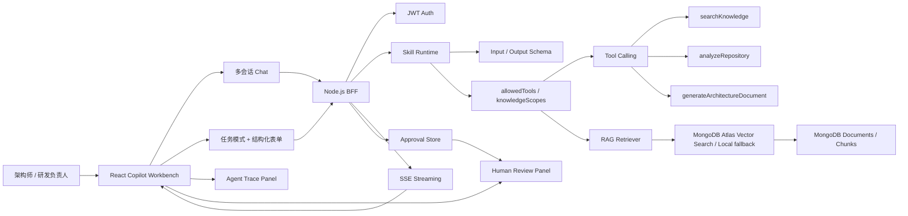

# AI Architecture Copilot

面向 AI 产品研发流程与前端工程场景的开源 MVP：把 AI 引入需求分析、页面原型、接口协议、研发任务拆解和人工确认流程，展示 Skill Runtime、Tool Calling、RAG、Context Engineering、Human-in-the-loop 和 Agent Trace 如何落到一个真实可运行的前端工作台。

这个项目不是“大而全 AI 平台”，也不是普通 Chatbot。它聚焦一个清晰场景：

> 帮助研发团队把业务需求转成 PRD 摘要、页面结构、接口协议、研发任务和风险确认点，并让 AI 执行过程可解释、可审计、可人工确认。

它适合用于：

- 团队内部探索 AI Coding、RAG、Agent 工作流的 PoC。
- AI Native Frontend / AI 应用工程化的本地实践样例。
- 研发效能、架构治理和知识库工作流的产品原型。
- GitHub 开源项目展示“前端架构能力如何迁移到 AI 应用工程”。

## 能力映射

| 能力模块 | 项目对应实现 |
|---|---|
| AI 进入研发流程 | `AI 产品工作流 Skill` 和 `研发提效 Skill` 支持 PRD、页面原型、接口协议、任务拆解、代码草案、测试策略和文档草稿 Artifact |
| AI 产品落地 | 多会话智能助手 + RAG 知识库 + Agent Trace + 人工确认 |
| Agent / Prompt / Context Engineering | SkillDefinition、allowedTools、knowledgeScopes、Context Pack、Prompt Contract |
| AI 产品交互 | SSE 流式输出、停止生成、重新生成、引用来源、Trace 时间线、审批节点 |
| 大前端技术趋势 | React + TypeScript + Less + Node BFF + MCP POC + LLM Provider Adapter |
| Agent 体验 / 多模态展示 | Chat、Markdown、代码高亮、Artifact 面板、Trace、文档草稿、Context JSON |

## 版本迭代

### 当前迭代：AI Product Workflow Workbench

这一版把页面从说明型展示收敛成真实产品工作区：

- 新增 `AI 产品工作流 Skill`，支持“业务需求输入 -> 需求摘要 -> 页面原型 -> 接口协议 -> 研发任务拆解 -> 人工确认”的端到端流程。
- 新增 `generateProductWorkflowArtifacts` 工具，按用户输入的业务需求、目标用户、交付目标和约束条件生成 PRD 文档规范、页面流程、API Contract、Task Breakdown 和风险确认点。
- 项目资料同步入口收敛到 Knowledge Context 模块，主流程不再依赖“一键准备 Demo”，而是通过真实的输入、RAG 检索、Tool Calling、LLM 流式输出和 Artifact 生成串起链路。
- 增强 AI 产品交互细节：流式光标、复制回答、复制代码块、历史回答编辑回输入框、停止生成和重新生成。
- 新增 AI Run Lifecycle 状态机：`validating -> retrieving -> tool_running -> streaming -> waiting_approval -> completed`，失败和用户中断分别进入 `failed`、`cancelled`。
- 主流程只保留任务输入、Skill 约束、RAG Context、Artifact、Agent Trace 和人工确认。
- 大版本路线从主视觉移到紧凑 Release Plan，避免像 PPT 展示页。
- RAG 不再只是上传列表，支持按当前 Skill 的 `knowledgeScopes` 展示知识域、导入模板包、检索预览、chunk score 和引用来源。
- 竞品对齐从“能力罗列”改成 Product Benchmarks，用来解释产品原则，而不是占用主流程。
- Agent 输出从聊天文本升级为可审计 Artifact：代码草案、测试策略、文档草稿、Context Pack。

### 产品理念与真实链路

AI Architecture Copilot 的产品理念是：**AI 不直接替人做最终决策，而是把模糊需求转成可评审、可追踪、可确认的研发交付物。**

完整链路如下：

```text
业务需求 / 目标用户 / 交付目标 / 约束条件
  -> SkillDefinition 校验输入与权限
  -> 按 knowledgeScopes 检索知识库
  -> searchKnowledge 返回 chunks、score、citation
  -> generateProductWorkflowArtifacts 生成 PRD / 页面结构 / API / 任务 / 风险
  -> LLM Provider 流式生成解释性结论
  -> Agent Trace 记录每一步输入输出、耗时、token、错误
  -> Human-in-the-loop 对高风险结果确认、修改或拒绝
```

产品 Owner 可以这样介绍：

> 这是一个面向 AI 产品研发团队的 Copilot Workbench。它解决的问题不是“让 AI 聊天”，而是让 AI 进入真实研发流程：把业务需求转成 PRD 文档规范、页面原型结构、接口协议、研发任务和风险确认点。每一步都有引用来源和 Trace，可解释、可审计，并且在高风险节点保留人工确认。

### 竞品对齐点

| 参考产品 | 对齐方式 |
|---|---|
| Cursor | Task-first 输入方式，少菜单，围绕研发任务组织上下文 |
| GitHub Copilot Workspace | Artifact-first 输出，生成代码、测试、文档和 Context Pack |
| Dify | Skill / Tool / Knowledge Scope 分层，知识库支持模板包和引用来源 |
| LangSmith / LangGraph | Trace-first 执行轨迹，展示工具输入输出、耗时、token、错误和人工确认 |
| 企业 AI 平台 | Guardrails 内建到运行时：schema、allowedTools、knowledgeScopes、审批 |

## 当前完成度与产品化边界

当前版本已经具备一个 AI 工作流产品的核心闭环：

- 自然语言任务入口：用户不需要先理解复杂表单，可以直接描述目标。
- Skill Runtime：每个 Skill 有输入约束、输出约束、工具权限和知识域范围。
- RAG Context：按 Skill scope 检索知识库，展示 chunk、score、citation 和 retrieval backend。
- LLM Provider Adapter：支持 DeepSeek / OpenAI-compatible / DashScope，并保留本地 fallback。
- SSE 流式输出：支持停止、重新运行、失败降级和可见状态反馈。
- Artifact Workbench：输出 PRD、页面结构、API Contract、测试策略和风险确认。
- Agent Trace：记录意图理解、检索、工具调用、模型调用、产物生成和人工确认。
- Human-in-the-loop：高风险产物进入确认、修改或拒绝流程。

它已经达到“可演示、可解释、可继续工程化”的产品原型标准；距离线上生产级还需要补齐：

- 更强的权限体系：多租户、组织空间、角色权限、工具级授权。
- 更完整的运行态持久化：Agent Run 状态机持久化、恢复、重试、幂等和补偿。
- 更严谨的 Eval：引用准确率、Artifact 完整度、工具调用成功率、人工采纳率。
- 更强的模型治理：多 Provider 灰度、成本监控、限流、脱敏、审计和安全策略。
- 更成熟的知识库：生产 embedding provider、Atlas Vector Search / pgvector / Milvus 索引治理、增量更新和召回评估。

## 产品级补强说明

这一轮迭代把项目从“可演示工作台”继续向“可运行、可审计、可评估”的产品化形态推进，重点补齐五个链路。

### 1. 真实链路状态

系统不会把 fallback 包装成真实能力。页面会同时展示：

- `LLM Provider`：真实 Provider、fallback、mock、本次调用模型、streaming 状态和错误原因。
- `Vector Store`：`mongodb-atlas-vector-search`、`local-hash`、连接状态、索引名、向量字段和健康检查结果。
- `Run Quality`：引用、PRD、API、页面流程、任务拆解、风险确认、Trace 和 Provider 的质量检查结果。

当 DeepSeek / OpenAI-compatible 调用失败时，后端会降级到 deterministic runtime，同时在 Trace 中保留失败节点；当 Atlas Vector Search 未配置或 `$vectorSearch` 不可用时，RAG 会降级到 local-hash，并在界面显示 `fallback` 与失败原因。

### 2. Agent Run 后端状态机

Agent Run 不只存在于前端。后端会在 `agent_runs` 中持久化每次执行：

- `status`：`running / review_required / confirmed / paused / rolled_back / failed`
- `intent`：意图识别结果、置信度、目标用户和业务域
- `selectedSkill`：Agent 自动选择的 Skill
- `plan`：执行计划
- `sources`：RAG 命中的 chunk、score、citation
- `artifacts`：结构化交付物和版本记录
- `trace`：每一步输入、输出、耗时、token、错误和人工确认标记
- `logs`：运行日志和控制动作
- `quality`：Eval 质量评分

运行控制接口：

| API | 说明 |
|---|---|
| `POST /api/agent-studio/sessions/:id/runs/stream` | 创建 Agent Run，并通过 SSE 推送 plan、trace、sources、artifacts、delta、final |
| `POST /api/agent-studio/runs/:id/control` | 暂停、恢复、回滚、确认、拒绝 |
| `POST /api/agent-studio/runs/:id/review` | 写入人工审批意见 |
| `GET /api/agent-studio/runs` | 查询历史运行，用于 Run Registry 和审计 |

### 3. Artifact 交付物系统

Artifact 从“模型输出文本”升级为可管理交付物：

- 支持 PRD 文档规范、页面流程与原型结构、接口协议草案、研发任务拆解、风险和待确认问题。
- 每个 Artifact 带 `version`、`status`、`traceStepId`、`reviewStatus`、`versions` 和 `approvals`。
- 支持预览、复制、确认、保存版本、导出 Markdown、导出 JSON。
- Artifact 与 Trace 节点通过 `traceStepId` 关联，便于追溯“哪个步骤生成了哪个产物”。

Artifact 接口：

| API | 说明 |
|---|---|
| `PATCH /api/agent-studio/runs/:id/artifacts/:artifactId` | 修改内容或状态，自动生成版本记录 |
| `POST /api/agent-studio/runs/:id/artifacts/:artifactId/confirm` | 确认交付物，写入审批记录 |
| `GET /api/agent-studio/runs/:id/artifacts/:artifactId/export?format=markdown/json` | 导出 Markdown 或 JSON |

### 4. Eval 质量评估

Eval 不再只是样例按钮，而是用真实产品场景验证 Agent 输出质量。

内置 Case：

- AI 产品工作流：验证 PRD、页面结构、接口协议、任务拆解和 Trace。
- 智能客服知识库：验证知识库范围、页面原型覆盖、API 检索反馈和风险治理。
- 投研报告生成工作台：验证资料上传、行业知识检索、报告生成、章节草稿和人工复核。

每次运行后生成 `quality`：

| 指标 | 检查方式 |
|---|---|
| 引用命中 | 是否命中真实 sources，是否有 citation 和 score |
| PRD 完整度 | 是否生成 PRD / summary 类交付物 |
| API 合理性 | 是否生成 API Contract |
| 页面流程 | 是否生成 UI Flow / Page Structure |
| 任务拆解 | 是否生成 Task Breakdown |
| 风险确认 | 是否生成 Risk / Questions |
| Trace 可复盘 | 是否有多个可审计 Trace Step |
| Provider 状态 | 是否明确标记真实模型或 fallback |

### 5. UI QA 约束

当前核心页面按 1440 和 1920 宽度做了布局约束：

- 主工作区采用三栏结构：左侧上下文、中间执行流、右侧 Trace / 引用 / 审批。
- Agent Trace 默认只展示步骤，点击后可多节点展开详情，不遮挡其他节点。
- Copilot IM 每条消息独立气泡展示，用户和 AI 消息有明确间距和角色区分。
- Artifact 使用列表 + 详情的工作台布局，避免五张卡片横向挤压。
- 流式分析区设置最小高度和滚动边界，长内容不挤压输入区。

移动端目前只保证核心内容可纵向访问，尚未按生产标准做完整适配；如果要上线，需要补移动端断点和触控交互 QA。

## 前端架构设计

前端采用 `React + TypeScript + Vite + Less`，定位为 AI Native 工作台，而不是传统中后台表单系统。

```text
client
  src
    api                 # request / SSE streamRequest / auth token 注入
    components          # 通用 UI 原语：Header、Status、Panel 等
    modules
      copilot           # Copilot Workbench：Skill、RAG、Artifact、Trace 主流程
      agent-studio      # Agent Runtime Console：Agent 编排、控制与审计中心
      ...
    platform            # Shell、子应用注册、路由、i18n、全局事件
    styles.less         # 全局设计语言与模块样式
```

### 分层职责

| 层级 | 职责 |
|---|---|
| Platform Shell | 左侧导航、路由加载、登录态、i18n、子应用注册和布局约束 |
| Feature Module | 每个业务能力独立目录维护自己的状态、视图、交互和 API 编排 |
| API Client | 统一鉴权、错误处理、JSON 请求、SSE 流式事件解析和 Abort 控制 |
| Runtime UI | 对 `idle / retrieving / streaming / review_required / failed / completed` 等状态做可视化 |
| Artifact UI | 将模型输出拆成可预览、可复制、可确认、可导出的结构化产物 |
| Trace UI | 默认展示步骤，按需展开输入输出、耗时、token、错误和人工确认信息 |

### 前端 AI 交互原则

- **自然语言优先**：输入目标，而不是先填复杂表单。
- **过程可见**：检索、工具调用、模型生成、审批都必须能被用户看到。
- **输出结构化**：回答不是纯文本，而是 PRD、页面结构、API、任务、风险等 Artifact。
- **高风险可控**：涉及写入、发布、调用外部工具的动作必须进入人工确认。
- **可恢复**：支持停止、重试、重新编辑 Prompt、复制回答和回填输入。

## Agent Runtime Console 设计

`Agent Runtime Console` 是新增的 Agent 运行控制台，合并了“AI 对话机器人”和“智能助手”的自然语言入口，但产品定位不是闲聊，而是 Agent 编排、控制与审计中心。它和 `Copilot 工作台` 的分工如下：

| 模块 | 主导方式 | 核心价值 |
|---|---|---|
| Copilot 工作台 | 人选择 Skill，AI 生成产物 | 研发交付工作台 / Artifact 生成器 |
| Agent Runtime Console | Agent 自动识别意图、选择 Skill、生成 Plan 并执行 | Agent 运行控制台 / 编排与审计中心 |

### 典型流程

```text
用户输入自然语言需求
  -> detectIntent 识别任务类型
  -> Skill Runtime 选择 Agent 与工具权限
  -> Agent Plan 生成执行计划
  -> RAG 检索项目知识库
  -> Tool Runtime 执行工具调用
  -> LLM Provider 流式生成
  -> Audit Trace 记录输入输出、耗时、token、错误
  -> requestHumanReview 等待人工确认
  -> pause / resume / rollback / confirm 写入审计日志
```

### 前后端链路

| 模块 | 说明 |
|---|---|
| `client/src/modules/agent-studio` | AgentOps Console、Run Registry、Execution Graph、Node Detail、Tool Call Audit、Audit Timeline、Run Control |
| `POST /api/agent-studio/sessions/:id/runs/stream` | 后端 Agent Run SSE 主链路 |
| `POST /api/agent-studio/runs/:id/control` | 暂停、恢复、回滚等运行控制动作 |
| `agent_sessions` | 会话、消息、当前 Agent |
| `agent_runs` | Prompt、Intent、Selected Skill、Plan、Sources、Artifacts、Trace、Logs、Provider、运行状态 |
| `agent_reviews` | 人工确认、修改、拒绝记录 |
| `agent_audit_logs` | 线上化后可拆出的审计日志集合；当前随 `agent_runs.logs` 保存 |

### 为什么不单独再做一个 Chatbot 菜单

普通 Chatbot 容易变成“问答窗口”，与研发交付主线割裂。当前设计把对话、意图理解、RAG、Artifact、Trace、运行控制和人工确认合并到 `Agent Runtime Console`，用户看到的是一个完整 Agent 运行系统：

- 顶部：运行健康度，包括 Runs、Sessions、等待审批、失败数和平均耗时。
- 左侧：Run Registry，支持按状态与关键字检索历史运行。
- 中间：Command Center、Agent Execution Graph、Plan Board、Tool Call Audit、Audit Log 和 Transcript Snapshot。
- 右侧：Node Detail、Audit Timeline、Run Control、引用来源和 Artifact 留档。

`Agent Runtime Console` 的核心不是“生成内容”，而是让每一次 Agent 执行都可观察、可解释、可暂停、可恢复、可回滚、可审批和可复盘。

这样更接近 Cursor / Copilot Workspace / Dify / LangSmith 的工作台型产品形态。

## 线上级 AI Agent 扩展方案

当前项目可以继续扩展成线上可用 Agent 系统，建议按下面方向演进：

| 能力 | 当前实现 | 线上化增强 |
|---|---|---|
| 状态机 | 前后端均有运行状态 | 后端持久化状态机、恢复、重试、幂等、补偿 |
| 工具调用 | 普通函数工具和 MCP POC | 工具注册中心、权限策略、审批策略、审计日志 |
| RAG | 本地 hash fallback + Atlas adapter | 生产 embedding、向量索引治理、召回评估、引用质量检查 |
| 模型 | Provider Adapter | 多模型路由、成本预算、限流、降级、脱敏 |
| 交付物 | PRD / Flow / API / Test / Risk | 版本管理、多人协作、Diff、导出、发布审批 |
| 质量 | lint / typecheck / 本地校验 | Eval Pipeline、回归集、CI 质量门禁、线上观测 |

产研测交付链路建议沉淀为固定 Agent Graph：

```text
Requirement Intake
  -> Clarification
  -> Context Retrieval
  -> Product Planning
  -> UI / API Contract Draft
  -> Test Strategy
  -> Risk Review
  -> Human Approval
  -> Delivery Backlog
```

### v1.0 AI Dev Workflow

- 研发提效 Skill。
- 代码草案 Artifact。
- 测试策略 Artifact。
- 文档草稿 Artifact。
- PR 质量门禁与人工确认。

### v2.0 RAG & Context Engineering

- MongoDB Atlas Vector Search Adapter。
- 本地 hash embedding fallback。
- 知识域过滤和引用来源。
- 知识模板包导入。
- 当前 Skill 知识域检索预览。
- chunk score 和引用来源详情。
- Prompt Contract。
- Context Pack。
- 上下文分层、压缩策略和 Guardrails。

### v3.0 Agent Runtime

- SkillDefinition 运行时。
- Tool Calling 权限约束。
- SSE 流式输出。
- Agent Trace。
- Human-in-the-loop 审批。

### v4.0 Open Platform Roadmap

- MCP Server POC。
- OpenAI-compatible LLM Provider Adapter。
- 向量库继续演进：pgvector / Milvus / 多 embedding provider。
- 将 MCP POC 替换为官方 SDK 实现。
- 增加 Eval：引用准确率、工具调用成功率、审批通过率、AI 建议采纳率。
- 增加 Coding Agent 文件级变更预览，但继续保留人工确认。

## 快速启动

```bash
npm install
npm run mongo
npm run dev
```

访问：

- 前端：http://127.0.0.1:5173
- 后端：http://127.0.0.1:4000
- 健康检查：http://127.0.0.1:4000/health

演示前自检：

```bash
npm run verify
```

登录账号：

```text
removed-default-admin@example.invalid
removed-public-password
```

## mcp-poc 增强点

### 1. 真实 LLM Provider Adapter

默认仍然使用 `mock`，保证本地无 API Key 也能稳定运行。有 Key 时可切换到真实模型。后端通过 OpenAI-compatible `chat.completions` 协议接入，真实 Provider 会直接以 SSE token 形式透传到前端，不再等待完整结果后本地模拟流式。

```bash
LLM_PROVIDER=openai
LLM_API_KEY=sk-xxx
LLM_MODEL=gpt-4.1-mini
```

DeepSeek：

```bash
LLM_PROVIDER=deepseek
DEEPSEEK_API_KEY=sk-xxx
LLM_MODEL=deepseek-chat
```

通义千问兼容模式：

```bash
LLM_PROVIDER=dashscope
DASHSCOPE_API_KEY=sk-xxx
LLM_MODEL=qwen-plus
```

任意 OpenAI-compatible 服务：

```bash
LLM_PROVIDER=openai-compatible
LLM_BASE_URL=https://your-provider.example.com/v1
LLM_API_KEY=xxx
LLM_MODEL=your-model
```

配置优先级：

| 字段 | 说明 |
|---|---|
| `LLM_PROVIDER` | `mock` / `openai` / `deepseek` / `dashscope` / `openai-compatible` |
| `LLM_API_KEY` | 通用 API Key，优先级最高 |
| `OPENAI_API_KEY` | OpenAI 专用 Key |
| `DEEPSEEK_API_KEY` | DeepSeek 专用 Key |
| `DASHSCOPE_API_KEY` | 通义千问兼容模式专用 Key |
| `LLM_BASE_URL` | 仅 `openai-compatible` 必填；其他 Provider 有默认值 |
| `LLM_MODEL` | 可覆盖默认模型 |

运行时接口：

```text
GET /api/copilot/runtime
```

页面左侧 Runtime Board 会显示：

- LLM 当前是 `live` 还是 `fallback`。
- 当前模型名。
- 真实模型是否启用流式输出。
- RAG 后端。
- MCP transport 和启动命令。

### 2. MCP Server POC

本分支新增一个最小可运行 MCP Server：

```bash
node server/src/mcp/architectureMcpServer.js
```

实现位置：

```text
server/src/mcp/architectureMcpServer.js
```

它暴露：

resources:

- `architecture://documents`
- `project://rules`

tools:

- `search_architecture_docs`
- `inspect_project_structure`
- `generate_project_rule`
- `generate_engineering_artifacts`
- `compose_context_pack`

prompts:

- `architecture_review`
- `migration_plan`

说明：

- 当前实现不依赖 SDK，使用 stdio JSON-RPC 和 `Content-Length` framing。
- MCP Host 应使用 `node server/src/mcp/architectureMcpServer.js` 作为 command，避免 `npm run` banner 污染 stdio。
- 这是 POC，用于证明工具、资源、Prompt 可以标准化暴露给外部 AI Host。
- 后续可替换为官方 MCP SDK，并增加鉴权、审计和工具权限策略。

### 3. RAG 后端抽象

当前本地默认：

```bash
RAG_BACKEND=local-hash
```

特点：

- 离线可跑。
- 支持文档切分、本地 hash embedding、向量相似度和关键词融合。
- 适合本地链路验证，不宣传为生产检索质量。

MongoDB Atlas Vector Search：

```bash
RAG_BACKEND=mongodb-atlas
MONGODB_ATLAS_URI=mongodb+srv://<user>:<password>@<cluster>/<db>?retryWrites=true&w=majority
RAG_VECTOR_INDEX=chunks_vector_index
RAG_VECTOR_PATH=embedding
RAG_VECTOR_DIMENSIONS=96
RAG_CREATE_VECTOR_INDEX=false
```

说明：

- 前端 `Knowledge Context -> Vector Store -> 检测真实向量库` 会请求 `/api/copilot/vector-store/health`，后端会真实检查 MongoDB 是否连接、Atlas `$vectorSearch` 是否可执行、索引名和向量字段是否匹配。
- 只有健康检查返回 `live: true` 时，界面才会显示 `live vector db`；否则会显示具体失败原因，不会把 local fallback 包装成真实向量库。
- 文档上传或模板导入后，chunk 会写入 `chunks` collection，并带上 `embedding` 数组字段。
- `RAG_BACKEND=mongodb-atlas` 时，检索会调用 MongoDB Atlas `$vectorSearch`。
- 如果 Atlas 索引未创建、当前 MongoDB 不是 Atlas、或 `$vectorSearch` 不可用，服务会自动降级为 local-hash，并在 RAG status / Trace 中标出 `mode: fallback` 与错误原因。
- `RAG_CREATE_VECTOR_INDEX=true` 时，服务会尝试通过 MongoDB driver 请求创建 Search Index；生产环境更建议在 Atlas 控制台或 IaC 中显式管理索引。

真实向量库展示步骤：

1. 在 MongoDB Atlas 创建 M10+ 或支持 Atlas Vector Search 的集群。
2. 在 `chunks` collection 创建 Vector Search Index，索引名与 `RAG_VECTOR_INDEX` 一致。
3. 将 `.env` 改为 `RAG_BACKEND=mongodb-atlas`，并填写 Atlas `MONGODB_ATLAS_URI`。
4. 执行 `npm run vector:health -- --seed`，脚本会写入一个 health chunk 并真实执行 `$vectorSearch`。
5. 如果 Atlas Index 尚未创建，可先执行 `npm run vector:health -- --seed --create-index` 请求创建索引；生产环境建议在 Atlas 控制台显式创建。
6. 重启后端，登录系统，在 `Knowledge Context` 点击“同步项目资料”写入项目 chunks。
7. 点击“检测真实向量库”，看到 `live vector db` 后再执行“检索预览”或“生成工作流”。
8. 检索结果的 `retrievalBackend` 应显示为 `mongodb-atlas-vector-search`。

Atlas Vector Search index 示例：

```json
{
  "fields": [
    {
      "type": "vector",
      "path": "embedding",
      "numDimensions": 96,
      "similarity": "cosine"
    },
    {
      "type": "filter",
      "path": "tags"
    }
  ]
}
```

后续可替换目标：

- `pgvector`
- `milvus`

抽象入口：

```text
server/src/services/ragEngine.js
server/src/store/mongoStore.js
```

### 4. 后端 API 纯净度

`mcp-poc` 分支已移除旧增长平台残留挂载：

- `/api/dashboard`
- `/api/agent`
- `/api/enablement`
- `/api/rag`
- `/api/ai`
- `/api/harness`
- `/api/observability`
- `/ws`

当前后端只保留：

- `/api/auth`
- `/api/copilot`
- `/health`
- `/`

根接口名称也已改为：

```text
AI Architecture Copilot API
```

### 5. UI 专业度增强

本分支补强：

- Runtime Board：展示 LLM / RAG / MCP 运行时状态。
- Skill Schema 面板：可展开查看 inputSchema、outputSchema、allowedTools、knowledgeScopes。
- 生成中 skeleton：提升流式生成等待体验。
- Trace Timeline：用状态条表达执行路径。
- 引用来源详情：可展开查看来源和 score。
- 审批历史：确认、修改、拒绝会保留最近记录。

## 产品收敛原则

MVP 只保留一个侧边栏入口：`AI Copilot`。

原因：

- 之前多个模块入口展示的是相同 Copilot 能力，会削弱产品边界。
- MVP 的核心不是“模块数量”，而是完整跑通 Agent 工程闭环。
- Skill、RAG、Trace、人工确认、接入文档不再作为重复页面存在，而是沉淀在 Copilot Workbench 内部。

当前工作台分为三列：

- 左侧：会话历史、Skill 系统、RAG 默认模板和上传入口。
- 中间：任务模式、结构化输入、最终请求预览、流式生成结果。
- 右侧：Agent Trace 路径还原、执行步骤详情、人工确认节点。

## MVP 必备功能

### 1. 多会话 AI Chat

已实现：

- 多会话创建和历史切换。
- SSE 流式输出。
- Markdown 渲染。
- 代码块高亮。
- 会话历史持久化到 MongoDB/FileStore。
- 停止生成：前端 `AbortController` 中断流式请求。
- 重新生成：复用最近一条用户消息重新发起生成。

入口文件：

- `client/src/modules/copilot/CopilotWorkbench.tsx`
- `server/src/routes/copilot.js`

### 2. 细化生成工作台

MVP 不提供零散菜单，而是在一个 Workbench 内内置 5 个任务模式：

- 研发提效：输出代码草案、测试策略、文档草稿、PR 质量门禁。
- 需求分析：输出业务目标拆解、非功能约束、验收标准、待确认问题。
- 架构评审：输出架构决策、模块边界、风险清单、演进路线。
- 代码审查：输出风险发现、修复建议、测试缺口、合并建议。
- 上下文工程：输出 Prompt Contract、Context Pack、压缩策略、Guardrails。

每个任务模式都会绑定：

- 默认生成目标。
- 结构化字段。
- 对应 Skill。
- 可用工具。
- Artifact 展示。

这能体现 MVP 是“受约束的技能运行时”，不是单纯 Prompt 页面。

### 3. Skill 系统

内置 5 个 Skill：

- 研发提效 Skill：生成代码草案、测试策略、文档草稿和 PR 质量门禁。
- 需求分析 Skill：拆解目标、约束、验收标准和风险。
- 架构评审 Skill：审查前端架构、BFF、RAG、Agent、可观测性和发布风险。
- 代码审查 Skill：关注 PR 风险、测试缺口、性能和工程规范。
- 上下文工程 Skill：设计 Prompt Contract、Context Pack、压缩策略和 Guardrails。

每个 Skill 都符合以下结构：

```ts
type SkillDefinition = {
  id: string;
  name: string;
  description: string;
  systemPrompt: string;
  inputSchema: JSONSchema;
  outputSchema: JSONSchema;
  allowedTools: string[];
  knowledgeScopes: string[];
  version: string;
};
```

设计重点：

- 输入约束：用 `inputSchema` 描述必填字段和类型。
- 输出约束：用 `outputSchema` 约束结构化结果。
- 可用工具：每个 Skill 只能调用 `allowedTools` 中的工具。
- 知识范围：RAG 检索按 `knowledgeScopes` 选择上下文。
- 版本管理：Skill 带 `version`，便于灰度、回滚和审计。

### 4. Tool Calling

MVP 内置 5 个普通函数工具，接口设计保持可迁移到 MCP Server：

- `searchKnowledge`：按 Skill 的 `knowledgeScopes` 检索研发知识库。
- `analyzeRepository`：分析当前工程栈、模块、关注点和风险。
- `generateArchitectureDocument`：生成 Markdown 架构文档草稿。
- `generateEngineeringArtifacts`：生成代码、测试、文档类 Artifact。
- `composeContextPack`：生成 Context Engineering 分层上下文包。

工具调用不是固定假流程。后端会根据 `allowedTools` 动态决定是否执行：

- 研发提效 Skill：调用 `searchKnowledge`、`analyzeRepository`、`generateEngineeringArtifacts`。
- 需求分析 Skill：调用 `searchKnowledge`。
- 架构评审 Skill：调用 `searchKnowledge`、`analyzeRepository`、`generateArchitectureDocument`。
- 代码审查 Skill：调用 `searchKnowledge`、`analyzeRepository`。
- 上下文工程 Skill：调用 `searchKnowledge`、`composeContextPack`。

工具调用结果会进入 Agent Trace，包括 Tool 名称、输入参数、输出摘要、耗时、token 使用量和错误信息。

### 5. 轻量 RAG 知识库

已实现：

- 上传 Markdown、TXT、PDF。
- 文档切分。
- 本地 embedding。
- MongoDB Atlas Vector Search / local-hash 双后端检索。
- 回答展示引用来源。
- 根据 Skill 限定知识范围。
- 支持同步当前仓库真实项目文件作为 RAG 语料。
- 检索质量面板展示 query、scopes、backend、latency、chunk、score 和 source path。
- 默认知识模板可选择导入。

默认真实项目语料包括：

- `README.md`
- `package.json`
- `client/src/modules/copilot/CopilotWorkbench.tsx`
- `server/src/routes/copilot.js`
- `server/src/services/ragEngine.js`
- `server/src/store/mongoStore.js`
- `server/src/services/llmProvider.js`
- `server/src/mcp/architectureMcpServer.js`

可选模板知识包括：

- 微前端架构设计文档。
- SDK 规范与工程约束。
- IM 架构文档。
- 低代码组件协议。
- 项目开发规范。

说明：

- Markdown/TXT 直接读取文本。
- PDF 在 MVP 中支持上传和元数据入库；生产环境可接 PDF parser 抽取正文。
- 项目文件同步后会写入 `documents` 和 `chunks`，并带上 `sourceType=project-file`、`sourcePath`、`chunkIndex` 等字段。
- 当前已接入 MongoDB Atlas Vector Search adapter；本地没有 Atlas 索引时自动 fallback 到 hash embedding。
- 当前 embedding 仍是 96 维本地 deterministic embedding，用于稳定演示向量库链路；生产级语义检索建议替换为 OpenAI / 通义 / bge-m3 等 embedding provider。
- 这个 RAG 不是通用问答，而是按 Skill 动态选择知识域的研发架构知识库。

### 6. 人工确认节点

AI 生成架构建议后会进入暂停状态：

- 用户确认。
- 用户修改。
- 用户拒绝。
- 修改后继续生成最终文档。

接口：

```text
POST /api/copilot/approvals/:id/confirm
POST /api/copilot/approvals/:id/revise
POST /api/copilot/approvals/:id/reject
```

约束：

- 写文件、改配置、发请求等高风险动作不能自动执行。
- 高风险工具必须进入人工确认。
- 审批结果必须保存，便于 Trace 和审计。

### 7. Agent Trace 面板

右侧 Trace 面板展示完整执行轨迹：

```text
用户请求
→ 选择 Skill
→ 加载上下文
→ 调用知识库
→ 按 allowedTools 调用工具
→ 生成结构化结果
→ 等待人工确认
→ 输出最终文档
```

每一步展示：

- 状态：running / success / waiting / failed。
- 耗时。
- Tool 输入输出。
- token 使用量。
- 错误信息。
- 是否需要人工确认。

新增路径还原机制：

- `路径还原`：从最近一次 assistant 消息中恢复 Trace。
- `下一步`：按步骤重放执行轨迹。
- 用于说明“Agent 不是黑盒，而是可审计、可复盘的执行系统”。

## SSE 与 WS 取舍

MVP 的核心生成链路采用 SSE，不把 WebSocket 放进主路径。

原因：

- SSE 更适合服务端到客户端的单向流式生成。
- 浏览器原生支持文本流，中止生成可以直接用 `AbortController`。
- Agent Trace 和 token delta 与 SSE 事件天然匹配。
- WebSocket 更适合多人协同、IM、实时通知、低码协同编辑等双向场景。

后续如果加入多人评审、协同编辑、在线 IM 或实时告警，可以把 WS 作为独立实时通道引入，不污染当前生成链路。

## 架构设计



## 动态对应关系

```text
任务模式
  -> SkillDefinition
    -> inputSchema / outputSchema
    -> allowedTools
    -> knowledgeScopes
      -> RAG 检索上下文
      -> Tool Calling 执行结果
      -> Agent Trace
      -> Human Approval
```

示例：

- 选择“代码审查”时，Skill 会切换到 `code-review`，只允许调用 `searchKnowledge` 和 `analyzeRepository`。
- 选择“架构文档”时，Skill 会切换到 `architecture-review`，允许生成文档草稿并进入人工确认。
- RAG 引用来源会随 Skill 的 `knowledgeScopes` 和用户输入变化。

## API 设计

```text
GET  /api/copilot/skills
GET  /api/copilot/runtime
GET  /api/copilot/sessions
POST /api/copilot/sessions
GET  /api/copilot/sessions/:id
POST /api/copilot/sessions/:id/messages/stream
GET  /api/copilot/knowledge
GET  /api/copilot/knowledge/templates
POST /api/copilot/knowledge/templates/:id/import
POST /api/copilot/knowledge/upload
POST /api/copilot/knowledge/search
POST /api/copilot/approvals/:id/confirm
POST /api/copilot/approvals/:id/revise
POST /api/copilot/approvals/:id/reject
```

## 前端目录结构

```text
client/src
  api/
    client.ts              # REST + SSE 请求封装
  app/
    App.tsx                # 登录、Shell、子应用容器
  components/
    ui.tsx                 # 通用 UI 基础组件
  modules/
    copilot/
      CopilotWorkbench.tsx # MVP 主工作台
  platform/
    events.ts              # 全局事件总线
    i18n.ts                # 国际化入口
    microFrontend.tsx      # Wujie/本地子应用容器
    router.ts              # Shell 路由
    subapps.tsx            # 子应用 manifest
  main.tsx
  styles.less
```

本分支删除了与 AI Architecture Copilot MVP 无关的旧模块，避免“多个入口、同一功能”的产品噪音。

## 约束规范

### Skill 规范

- Skill 必须有稳定 id 和 version。
- Skill 必须声明 inputSchema 和 outputSchema。
- Skill 只能调用 allowedTools 中的工具。
- Skill 只能访问 knowledgeScopes 中的知识域。
- Skill 输出必须进入 Trace，不能黑盒执行。

### Tool 规范

- Tool 必须有明确输入输出。
- Tool 输入输出必须记录到 Trace。
- 高风险 Tool 必须进入人工确认。
- Tool 接口保持函数式，后续可迁移到 MCP Server。

### RAG 规范

- 文档必须带知识域 tags。
- 检索必须展示引用来源。
- 回答不得脱离引用来源编造事实。
- 不同 Skill 使用不同 knowledgeScopes。
- 生产环境可替换 embedding 和向量数据库，但调用契约不变。

### Human-in-the-loop 规范

- 架构文档生成、配置变更、代码修改等动作必须等待人工确认。
- 用户可确认、修改或拒绝。
- 审批结果必须持久化。
- Trace 必须标记 humanRequired。

### 前端工程规范

- 前端源码使用 TypeScript + Less。
- MVP 只保留 `modules/copilot` 主模块。
- 平台能力放在 `platform`。
- API 和 SSE 统一通过 `api/client.ts`。
- 运行前执行项目级质量门禁：

```bash
npm run verify
```

`npm run verify` 会依次执行前端 ESLint、TypeScript typecheck、Vite build，以及后端 Copilot/RAG/LLM 关键模块语法检查。

## 数据集合

MongoDB 连接：

```text
mongodb://127.0.0.1:27017/growth_ai_assistant
```

关键集合：

```text
users
documents
chunks
copilot_sessions
copilot_approvals
telemetry
```

## 后续演进

- 扩展更多真实 LLM Provider。
- 将普通函数 Tool 迁移为 MCP Server。
- 接入 OpenAI Agents SDK 或 LangGraph 的 durable execution。
- PDF 文档接入真实 parser。
- RAG 增加 pgvector / Milvus adapter，并替换为生产级 embedding provider。
- Trace 接入 OpenTelemetry。
- Approval 支持暂停恢复和多人审批。
- 引入 WS 支持多人协同评审、在线 IM 和实时通知。
