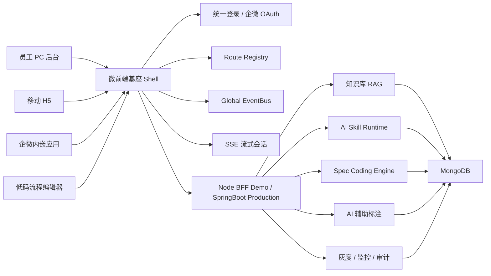

# 员工展业 AI 平台

本项目是面向“企业内部员工展业数字化 + 企微 AI 应用 + 内部知识库 RAG + AI Skill 编排”的本地可运行作品集。它不再是泛增长 Demo，而是对岗位要求做了专业收敛：员工 PC 展业后台、移动 H5、企业微信内嵌应用、企微智能问答助手、展业知识库、Spec Coding、AI Skill、AI 辅助标注、可视化看板、灰度发布与运维复盘。

当前 demo 使用 React + Node.js + MongoDB 本地运行。岗位中提到的 Java / SpringBoot 微服务，在本项目中以 Node BFF 模拟业务接口和 AI 编排层，README 中给出生产形态映射，便于本地快速展示。

## 快速启动

```bash
npm install
npm run mongo
```

另开终端：

```bash
npm run dev
```

访问：

- 前端：http://127.0.0.1:5173
- 后端：http://127.0.0.1:4000
- 健康检查：http://127.0.0.1:4000/health

账号：

```text
removed-default-admin@example.invalid
removed-public-password
```

MongoDB Compass 连接：

```text
mongodb://127.0.0.1:27017/growth_ai_assistant
```

重点集合：

```text
users
documents
chunks
assistant_sessions
enablement_specs
ai_skills
skill_runs
annotation_tasks
telemetry
```

## 岗位能力映射

### 1. 员工展业三端研发

项目内置三端产品模型：

- 员工 PC 展业后台：客户画像、展业任务、知识检索、审批流、运营看板。
- 员工移动 H5：客户拜访、资料转发、会话助手、离线缓存、移动审批。
- 企业微信内嵌应用：企微授权、外部联系人、智能问答、群发素材、会话记忆。

前端统一使用 React 体系，按终端抽象身份、权限、状态与组件。生产场景可进一步拆成：

```text
apps/
  pc-console
  mobile-h5
  wecom-embedded
packages/
  ui
  auth
  request
  sse-client
  wecom-bridge
  skill-runtime
```

### 2. 企微智能问答助手

功能已落地：

- 企微 OAuth 流程沙箱。
- 创建助手会话。
- SSE 流式问答。
- 会话记忆。
- 历史会话回溯。
- RAG 知识库召回。
- 引用来源展示。
- 防幻觉策略。

核心问题解决思路：

- 企微授权：code 换 userId，再归一到员工 identity。
- 多端登录：PC/H5/企微统一 employeeId，终端只作为 channel。
- 知识库幻觉：无引用不回答，低置信度拒答或转人工。
- 会话上下文：短期记忆保留最近窗口，事实来源走 RAG。
- 线上断流：SSE 需要 done 事件、异常重试和 traceId。

### 3. Spec Coding

项目提供 Spec Coding 工作台，用规格驱动交付：

- 需求规格。
- 数据模型。
- API Spec。
- 前端状态机。
- 防幻觉策略。
- 灰度上线清单。

对应岗位中的“沉淀 Spec Coding 前后端落地规范”。它不是写一份文档，而是把需求、接口、状态机、AI 策略、灰度和运维绑定到同一套可执行规格。

### 4. AI Skill 自定义与编排

项目内置 Skill Registry：

- 客户拜访简报 Skill。
- 企微问答防幻觉 Skill。
- AI 辅助标注质检 Skill。

每个 Skill 包含：

- id / name。
- trigger。
- tools。
- output。
- 执行日志。
- MongoDB 审计记录。

生产规范建议：

```ts
type AISkill = {
  id: string;
  name: string;
  inputSchema: JSONSchema;
  outputSchema: JSONSchema;
  tools: string[];
  permissions: string[];
  rollout: {
    grayPercent: number;
    departments: string[];
  };
  audit: boolean;
}
```

### 5. 内部展业知识库 RAG

当前 demo 已实现：

- 文档写入。
- 文档切片。
- 本地 embedding。
- 向量召回。
- keyword overlap 重排。
- 上下文拼接。
- SSE 回答输出。

生产可替换为：

- Milvus / pgvector / Elasticsearch hybrid search。
- bge / text-embedding 系列 embedding。
- Cross Encoder rerank。
- 知识库版本、有效期、权限过滤。
- 回答引用与置信度阈值。

### 6. AI 辅助标注与数据可视化

项目新增标注工作台，覆盖：

- 标注任务分配。
- 审核流程。
- 供应商质量。
- AI 预标注。
- 质量统计。
- 车辆轨迹回放。

当前用 SVG 和 Less 图表实现本地展示，生产建议接入：

- ECharts：质量统计、进度漏斗、供应商对比。
- OpenLayers / Leaflet：轨迹回放、地图标注、区域质量热力图。
- Web Worker：大规模轨迹点计算。
- 虚拟滚动：大任务列表。

### 7. 多端统一部署与运维

项目体现的运维闭环：

- 前端多终端统一构建。
- 后端 API 与 AI 编排层统一鉴权。
- MongoDB 保存业务数据与审计记录。
- `telemetry` 保存 Trace / 行为 / 耗时。
- README 给出 MongoDB Compass 查看方式。

生产建议：

- PC/H5/企微内嵌页静态资源分目录发布。
- Docker + K8s 部署 SpringBoot 微服务。
- 以 employeeId、terminal、release、traceId 贯穿日志。
- 按部门、员工、终端、企微 agentId 灰度。
- 故障复盘沉淀到内部知识库。

## 架构设计



## 前端工程架构

前端已从单体页面重构为 Vite + React + TypeScript + Less + ESLint 的微前端基座工程。`client/src` 源码不再使用 JS / JSX / CSS 文件，Node.js 后端仍保持 JavaScript 以便本地快速运行。

```text
client/src/
  app/App.tsx                       # 微前端基座：登录、布局、子应用生命周期
  platform/microFrontend.tsx        # Wujie 适配容器
  platform/router.ts                # 路由管理
  platform/subapps.tsx              # 子应用 manifest
  platform/events.ts                # 全局事件定义与通信
  platform/i18n.ts                  # 国际化 SDK 入口
  platform/realtime.ts              # WebSocket 实时客户端
  api/client.ts                     # API/SSE 客户端
  components/ui.tsx                 # 公共 UI 原语
  styles.less                       # 全局 Less 样式
  modules/
    overview/
    terminals/
    assistant/
    knowledge/
    spec/
    skills/
    annotation/
    flow-editor/
    ops/
```

工程约束：

- `vite.config.ts`：React 插件、端口、alias、sourcemap、manualChunks。
- `tsconfig.json`：禁止 JS 进入编译，统一 TS/TSX 类型边界。
- `eslint.config.mjs`：TypeScript + React Hooks 规则。
- `styles.less`：全局 Less，避免 CSS 散落到模块内部。
- `npm run typecheck --workspace client`：类型检查。
- `npm run lint --workspace client`：前端规范检查。
- `npm run build --workspace client`：生产构建。
- Shell 侧栏支持默认展开、折叠、独立展开/收起图标和折叠态 hover tooltip。

## 为什么选择 Wujie 而不是 qiankun

本项目选择 Wujie 作为微前端基座适配方向：

- 企微内嵌、H5、PC 后台、低码编辑器这类子应用对隔离要求高，Wujie 的 iframe + WebComponent 沙箱更适合控制样式、全局变量和运行时副作用。
- 当前项目需要同时演示本地 POC 和未来独立部署，Wujie 可以让子应用从本地 lazy 模块平滑升级为 remote entry。
- qiankun 生态成熟，但样式隔离、全局变量污染和多实例保活治理成本更高，更适合已有乾坤体系的企业存量项目。

当前 POC 采用 `Wujie-compatible local subapp` 模式：基座已经引入 `wujie-react` 和统一容器，子应用 manifest 中声明 `mode / sandbox / capabilities`。本地 Demo 直接 lazy 加载，生产只需要把某个子应用的 `mode` 改成 `wujie` 并配置 `entry` 即可独立部署。

## 子应用 Manifest 与事件通信

每个模块都是一个子应用，基座通过 manifest 注册：

```ts
{
  id: 'flow-editor',
  name: '低码流程编辑器',
  domain: 'workflow-core',
  mode: 'local',
  sandbox: 'wujie',
  capabilities: ['document-model', 'schema', 'plugin', 'selection', 'history', 'command', 'offline-sync'],
  loader: lazy(() => import('../modules/flow-editor/FlowEditor'))
}
```

基座向子应用注入：

- `user`：当前员工身份。
- `eventBus`：全局事件通信。
- `navigate`：基座路由跳转。
- `app`：当前子应用元信息。

事件总线同时挂到 `window.__ENABLEMENT_EVENT_BUS__`，用于 Wujie remote 子应用与基座通信。

全局事件包括：

- `shell:route-changed`
- `shell:subapp-mounted`
- `shell:subapp-unmounted`
- `assistant:asked`
- `knowledge:document-created`
- `spec:generated`
- `skill:run-completed`
- `flow:node-selected`
- `flow:command-executed`
- `telemetry:event`

## 国际化治理方案

新增 `i18n` 子应用，用于展示企业级国际化架构能力：

- 管道：`Crowdin 管理 -> Nacos 存储 -> 前端动态加载`。
- SDK：自研 `@company/i18n-sdk` 思路，封装多实例、namespace 缓存、动态加载和优雅降级。
- 时区：`用户设置 > 请求头 > 浏览器 Intl > 系统默认` 四级识别。
- RTL：通过 `document.dir` 和 PostCSS rtlcss 思路适配阿语等从右至左语言。
- 质量门禁：ESLint 插件拦截硬编码，CI 校验翻译覆盖率与缺失 key。

当前 Demo 中 `client/src/platform/i18n.ts` 提供运行时语言切换、RTL 方向切换、时区识别和动态 namespace 加载模拟。

## 实时通道与在线 IM

后端新增 `/ws` WebSocket 通道，前端通过 `client/src/platform/realtime.ts` 统一连接。

已实现：

- 平台总览订阅 `overview:update`，实时展示在线员工、WS 延迟、队列深度、活跃会话、知识库数量和增长信号。
- 新增 `im` 子应用，模拟中台和客户端在线 IM。
- IM 支持客户端发送、中台回复、机器人自动应答和会话审计。
- 后端把 IM 消息写入 `im_messages` 集合，便于 MongoDB Compass 查看。

## 低代码流程编辑器子应用

`flow-editor` 是本次重点增强的子应用，用于表达复杂编辑器 Owner 能力，而不是普通表单页面。

已实现能力：

- 块式文档模型：`workflow-document@1.0.0`，节点、边、位置、版本、opLog 与渲染层解耦。
- Schema 设计：`workflowSchema` 描述节点字段、命令类型、同步协议和跨端约束。
- Plugin Registry：审批、条件、动作、子流程节点通过插件注册，不再写死。
- Selection：支持单选与 Shift 多选，并通过全局事件上报选区。
- History / Command：`ADD_NODE / UPDATE_NODE / MOVE_NODE / DUPLICATE_NODE / DELETE_NODE / CONNECT_NODE / DISCONNECT_EDGE / APPLY_LAYOUT / RESET_DOCUMENT`。
- SVG 连线层：节点之间有真实连接线、箭头和命中热区，双击连线可删除。
- 在线拖拽节点：节点可在画布中拖拽，连线跟随节点移动，落点通过 `MOVE_NODE` 命令入栈。
- 右键上下文菜单：复制节点、设为连线起点、连接到目标、删除出边、添加插件节点、自动布局、删除节点。
- 快捷键体系：`⌘Z / Ctrl+Z` 撤销，`⌘⇧Z / Ctrl+Y` 重做，`⌘D / Ctrl+D` 复制，`A` 添加动作节点，`C` 添加条件节点，`L` 自动布局，`Delete` 删除。
- 模板库：内置“员工展业线索跟进”和“营销活动审批流”，支持在线编辑 JSON 模板、预览并保存到 LocalStorage。
- Undo / Redo：基于不可变快照的操作栈，保留最近 80 次。
- IME 处理：composition 阶段不触发中间更新，解决中文输入抖动。
- Worker 布局：`layout.worker.ts` 在 Worker 中计算节点位置，避免阻塞主线程。
- 离线优先：文档、clientId、opLog 持久化到 LocalStorage。
- 协同基础：opLog 作为跨端同步协议，生产可接 CRDT/Yjs/Automerge。

架构判断：

- ProseMirror / Tiptap 适合强富文本和块文档。
- Lexical 适合高性能富文本编辑。
- Slate 灵活，但团队规范和一致性治理成本更高。
- 当前流程画布更重视节点协议、插件系统、命令栈、跨端同步和可替换渲染层，因此采用自研 Document Model + React 渲染 POC，生产可替换为 Canvas/X6/React Flow 渲染引擎。

这部分用于表达你在流程编辑器内核、块式 Document Model、Schema、Plugin、Selection、History、Command、Worker 性能优化、右键菜单、快捷键体系、连线交互、离线优先和跨端一致性上的能力。

## GitHub 提交归属

当前仓库已将本地提交作者配置为：

```text
superwolfman <superwolfman@users.noreply.github.com>
```

这能让后续 commit 默认使用 GitHub 账号 `superwolfman` 的 no-reply 邮箱归属。当前项目还没有配置 remote；如果要每次提交后自动 push 到 GitHub，需要先设置远端仓库：

```bash
git remote add origin git@github.com:superwolfman/<repo-name>.git
```

远端仓库存在并完成 SSH/Token 授权后，即可执行：

```bash
git push -u origin main
```

生产 Java 微服务拆分建议：

```text
employee-auth-service
wecom-adapter-service
knowledge-rag-service
assistant-session-service
ai-skill-runtime-service
annotation-workbench-service
observability-service
gray-release-service
```

## 为什么这个项目匹配岗位

这个项目聚焦岗位主线，不再硬塞无关经历：

- 三端员工展业：PC / H5 / 企微。
- 企微 AI 应用：授权、内嵌、会话、上下文、知识库。
- RAG：内部展业知识库全链路。
- Spec Coding：规范化需求到交付。
- AI Skill：自定义、编排、复用与审计。
- 数据可视化：标注进度、质量统计、轨迹回放。
- 工程化：Monorepo、组件抽象、多端统一部署、监控定位。

## 面试讲解顺序

1. 平台总览：说明不是 Chatbot，而是员工展业全链路平台。
2. 三端展业：PC/H5/企微共用身份、权限和知识库。
3. 企微 AI 助手：SSE、会话记忆、RAG 引用、防幻觉。
4. Spec Coding：如何把需求约束成 API、状态机、灰度和运维清单。
5. AI Skill：如何沉淀可复用能力，而不是一次性 prompt。
6. 标注工作台：AI 预标注 + 人工审核 + 可视化。
7. 运维闭环：MongoDB 数据、traceId、灰度、复盘。

## 常用命令

```bash
npm run mongo
npm run dev
npm run build
```
