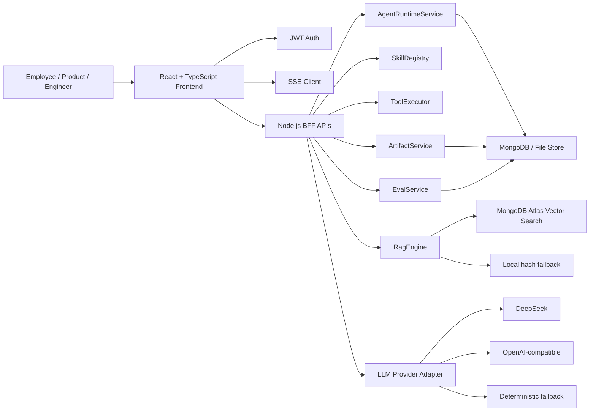
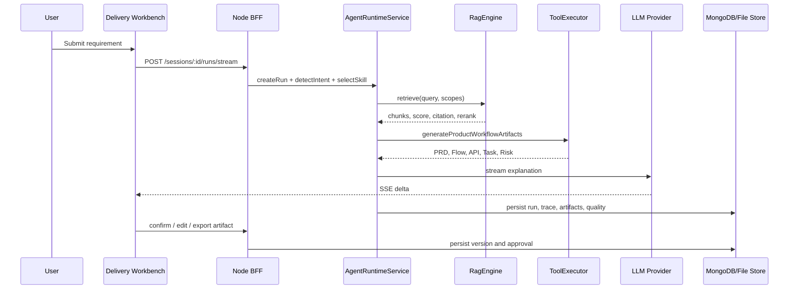

# AI Architecture Copilot

AI Architecture Copilot is an AI product delivery and AgentOps workbench for frontend architecture, AI application engineering, and internal R&D workflow automation.

It is not a generic chatbot. The project focuses on a concrete product scenario:

> Turn a business requirement into reviewable PRD, page structure, API contract, task breakdown, risk checklist, citations, trace, and human approval records.

The current branch `ailab-product-workflow` has converged on two primary product surfaces:

- **Copilot Delivery Workbench**: for business delivery, from requirement intake to artifacts.
- **AgentOps Console**: for runtime governance, audit, replay, approval, rollback, and quality evaluation.

Legacy Copilot / Agent modules are kept as debug and historical references, but the product direction is centered on the two workbenches above.

## Product Value

Modern AI applications should not stop at "chat with a model". In real R&D teams, AI output must be constrained, traceable, reviewable, and recoverable.

This project demonstrates a product-grade direction:

```text
Requirement
  -> Skill selection
  -> Knowledge scope
  -> RAG retrieval
  -> Tool calling
  -> Streaming generation
  -> Artifact versioning
  -> Human approval
  -> AgentOps audit and replay
```

Typical use cases:

- AI-assisted product requirement analysis.
- PRD, page structure, API contract, test strategy, and risk checklist generation.
- RAG-based internal knowledge reuse.
- Agent execution trace, tool-call audit, approval, rollback, and replay.
- AI product frontend architecture exploration.
- Team R&D efficiency workflow prototype.

## Current Feature Matrix

| Area | Current implementation |
|---|---|
| Frontend stack | React 19, TypeScript, Vite, Less |
| Backend stack | Node.js, Express, MongoDB / file fallback |
| Authentication | Employee login, JWT auth, protected APIs |
| LLM provider | DeepSeek / OpenAI-compatible / DashScope adapter with fallback status |
| RAG | Local hash fallback + MongoDB Atlas Vector Search adapter |
| Skill runtime | Skill definition, allowed tools, knowledge scopes, prompt contract |
| Tool calling | Knowledge search, repository analysis, artifact generation, product workflow generation |
| Streaming | SSE streaming, stop, retry, regenerate |
| Artifact system | PRD, page flow, API contract, task breakdown, test strategy, risk checklist |
| Artifact lifecycle | Preview, edit, copy, confirm, version record, export Markdown / JSON |
| AgentOps | Run registry, command center, state machine, trace timeline, tool audit, run detail, replay API |
| Human-in-the-loop | Approval, modification, rejection, review history |
| Eval | Scenario cases, citation hit, PRD completeness, API contract quality, trace replayability |
| MCP | Minimal stdio JSON-RPC MCP POC |

## Product Surfaces

### 1. Copilot Delivery Workbench

Path:

```text
/delivery-copilot
```

Positioning:

> A delivery-oriented AI workbench similar to Cursor / Copilot Workspace / Dify App Builder, but focused on product and frontend engineering artifacts.

Core user flow:

```text
1. Select a task mode or load an Eval Case
2. Enter business requirement, target user, delivery goal, constraints
3. Choose Skill and Knowledge Scope
4. Generate via SSE
5. Inspect citations and RAG debug result
6. Review structured artifacts
7. Confirm / edit / export artifacts
8. Send high-risk output to human approval
```

Main UI modules:

| Module | Responsibility |
|---|---|
| `SessionPanel` | Session list and active session switching |
| `SkillSelector` | Task mode, Skill, tools, and knowledge scope selection |
| `KnowledgeContext` | Vector store status, template packages, source documents |
| `RagDebugPanel` | Query, topK, score, chunk, rerank, filter reason, citation |
| `StreamPanel` | Streaming analysis process and generated answer |
| `ArtifactOverview` | Delivery status cards for PRD, Flow, API, Task, Risk |
| `ArtifactWorkbench` | Preview, edit, copy, confirm, export, versions |
| `TraceTimeline` | User-facing execution path |
| `ApprovalPanel` | Human approval state and review action |

The delivery workbench should feel like a real product workspace: it hides unnecessary debug noise, but preserves the evidence needed to explain how a result was produced.

### 2. AgentOps Console

Path:

```text
/agentops-console
```

Positioning:

> A runtime governance console inspired by LangSmith, LangGraph Studio, and AgentOps: it explains how an Agent ran, where it failed, and whether it can be recovered.

Core user flow:

```text
1. Enter command in Command Center
2. Select Agent / Skill / Knowledge Scope
3. Start Agent Run
4. Inspect Run Registry
5. Watch state machine transition
6. Expand Trace Timeline and Tool Call Audit
7. Open Run Detail drawer
8. Pause / resume / rollback / confirm / reject
9. Replay failed run
10. Review approval timeline and artifact archive
```

Main UI modules:

| Module | Responsibility |
|---|---|
| `CommandCenter` | Instruction input, agent selection, knowledge scope, run control |
| `RunRegistry` | Historical run list, status filtering, search |
| `StateMachinePanel` | Agent lifecycle visualization |
| `TraceAuditPanel` | Tool call audit, trace detail, token and latency |
| `RunDetailDock` | Selected run summary, artifacts, approval controls |
| `RunDetailDrawer` | Full run input, output, trace, sources, versions, logs |
| `RuntimeMetrics` | Latency, token usage, quality, baseline statistics |
| `RuntimeSummary` | Current runtime and provider status |

AgentOps is not another chat page. It is the operations layer for Agent systems.

## Architecture

### High-Level Architecture



### Runtime Sequence



### Agent Run Lifecycle

```text
idle
  -> validating
  -> intent_detected
  -> skill_selected
  -> retrieving
  -> tool_running
  -> streaming
  -> review_required
  -> confirmed
```

Failure and control paths:

```text
streaming -> failed
review_required -> paused
paused -> resumed
review_required -> rolled_back
failed -> replayed
review_required -> rejected
```

## Directory Structure

```text
.
├── client
│   └── src
│       ├── api
│       ├── components
│       ├── modules
│       │   ├── delivery-copilot
│       │   │   ├── DeliveryCopilot.tsx
│       │   │   ├── components
│       │   │   │   ├── ApprovalPanel.tsx
│       │   │   │   ├── ArtifactOverview.tsx
│       │   │   │   ├── ArtifactWorkbench.tsx
│       │   │   │   ├── KnowledgeContext.tsx
│       │   │   │   ├── RagDebugPanel.tsx
│       │   │   │   ├── SessionPanel.tsx
│       │   │   │   ├── SkillSelector.tsx
│       │   │   │   ├── StreamPanel.tsx
│       │   │   │   └── TraceTimeline.tsx
│       │   │   ├── types.ts
│       │   │   └── utils.ts
│       │   └── agentops-console
│       │       ├── AgentOpsConsole.tsx
│       │       ├── components
│       │       │   ├── CommandCenter.tsx
│       │       │   ├── RunDetailDock.tsx
│       │       │   ├── RunDetailDrawer.tsx
│       │       │   ├── RunRegistry.tsx
│       │       │   ├── RuntimeMetrics.tsx
│       │       │   ├── RuntimeSummary.tsx
│       │       │   ├── StateMachinePanel.tsx
│       │       │   └── TraceAuditPanel.tsx
│       │       ├── types.ts
│       │       └── utils.ts
│       ├── platform
│       └── styles.less
├── server
│   ├── src
│   │   ├── routes
│   │   │   ├── agentStudio.js
│   │   │   ├── auth.js
│   │   │   └── copilot.js
│   │   ├── services
│   │   │   ├── agentRuntimeService.js
│   │   │   ├── artifactService.js
│   │   │   ├── evalService.js
│   │   │   ├── llmProvider.js
│   │   │   ├── ragEngine.js
│   │   │   ├── skillRegistry.js
│   │   │   ├── sseParser.js
│   │   │   └── toolExecutor.js
│   │   ├── store
│   │   └── mcp
│   └── test
└── scripts
```

## Backend Service Boundaries

| Service | Responsibility |
|---|---|
| `agentRuntimeService` | Run lifecycle, state transition, replay, control patch, runtime summary |
| `skillRegistry` | Skill definitions, allowed tools, knowledge scopes, versioning |
| `toolExecutor` | Tool execution and structured artifact generation |
| `artifactService` | Artifact workflow, versioning, approval, export metadata |
| `evalService` | Quality score, checks, scenario scoring |
| `ragEngine` | Retrieval status, Atlas/local backend abstraction, rerank/filter reason |
| `llmProvider` | DeepSeek / OpenAI-compatible / DashScope / fallback streaming |
| `sseParser` | SSE framing/parser utilities |

The current `agentStudio.js` route still owns part of orchestration glue. The next engineering step is to make it a thin transport layer and move more runtime logic into service classes.

## API Overview

Authentication:

```text
POST /api/auth/login
GET  /api/auth/me
```

Copilot / legacy runtime:

```text
GET  /api/copilot/runtime
GET  /api/copilot/vector-store/health
GET  /api/copilot/models
```

Agent Studio / product workbench:

```text
GET  /api/agent-studio/blueprint
GET  /api/agent-studio/sessions
POST /api/agent-studio/sessions
GET  /api/agent-studio/runs
GET  /api/agent-studio/runs/:id
POST /api/agent-studio/sessions/:id/runs/stream
POST /api/agent-studio/runs/:id/control
POST /api/agent-studio/runs/:id/review
POST /api/agent-studio/runs/:id/replay
PATCH /api/agent-studio/runs/:id/artifacts/:artifactId
POST /api/agent-studio/runs/:id/artifacts/:artifactId/confirm
GET  /api/agent-studio/runs/:id/artifacts/:artifactId/export?format=markdown
GET  /api/agent-studio/runs/:id/artifacts/:artifactId/export?format=json
GET  /api/agent-studio/eval-cases
POST /api/agent-studio/eval-cases/:id/score
```

## RAG Design

The RAG layer is intentionally explicit about live / fallback state.

Supported modes:

| Mode | Description |
|---|---|
| `mongodb-atlas` | Uses MongoDB Atlas Vector Search when configured and healthy |
| `local-hash` | Local deterministic embedding fallback, used for offline demos |

RAG response should expose:

- query
- topK
- document title
- chunk content
- score
- rerank score
- rerank strategy
- filter reason
- citation
- retrieval backend

This is important because AI product users need to know why a source was selected, not just see a final answer.

### MongoDB Atlas Vector Search

Example `.env`:

```bash
RAG_BACKEND=mongodb-atlas
MONGODB_ATLAS_URI=mongodb+srv://<user>:<password>@<cluster>/<db>?retryWrites=true&w=majority
RAG_VECTOR_INDEX=chunks_vector_index
RAG_VECTOR_PATH=embedding
RAG_VECTOR_DIMENSIONS=96
RAG_CREATE_VECTOR_INDEX=false
```

Atlas Vector Search index example:

```json
{
  "fields": [
    {
      "type": "vector",
      "path": "embedding",
      "numDimensions": 96,
      "similarity": "cosine"
    },
    {
      "type": "filter",
      "path": "scope"
    }
  ]
}
```

Health check:

```bash
npm run vector:health
```

Seed and check:

```bash
npm run vector:health -- --seed
```

The UI must not hide fallback. If Atlas is unavailable, the interface should show local fallback and the exact reason.

## LLM Provider

DeepSeek:

```bash
LLM_PROVIDER=deepseek
DEEPSEEK_API_KEY=sk-xxx
LLM_MODEL=deepseek-chat
```

OpenAI-compatible:

```bash
LLM_PROVIDER=openai-compatible
LLM_BASE_URL=https://your-provider.example.com/v1
LLM_API_KEY=sk-xxx
LLM_MODEL=your-model
```

DashScope:

```bash
LLM_PROVIDER=dashscope
DASHSCOPE_API_KEY=sk-xxx
LLM_MODEL=qwen-plus
```

Runtime status should show:

- provider
- model
- live / fallback
- streaming support
- error reason

## Local Development

Install:

```bash
npm install
```

Start local MongoDB:

```bash
npm run mongo
```

Start app:

```bash
npm run dev
```

Open:

```text
Frontend: http://127.0.0.1:5173
Backend:  http://127.0.0.1:4000
Health:   http://127.0.0.1:4000/health
```

Default login:

```text
removed-default-admin@example.invalid
removed-public-password
```

Quality commands:

```bash
npm run lint
npm run typecheck
npm run test:server
npm run verify
```

## Testing Scope

Current server tests cover:

- SSE parser
- Skill registry
- Tool executor
- Artifact workflow
- Eval scoring
- Agent runtime service

The next testing focus:

- Agent control error paths
- Replay chain consistency
- Artifact version diff
- RAG retrieval fallback behavior
- Frontend interaction tests for streaming, approval, and export

## Product Maturity

Current status:

| Dimension | Status | Notes |
|---|---|---|
| Product flow | Good | Delivery and AgentOps surfaces are separated |
| Frontend architecture | Good, improving | New workbenches are componentized; legacy files remain |
| Backend architecture | Medium | Services exist; route layer still has orchestration glue |
| RAG credibility | Medium | Atlas adapter exists; live deployment depends on env and Atlas index |
| Agent runtime | Medium | State, trace, approval, replay exist; stronger durable state machine needed |
| Artifact lifecycle | Medium-high | Preview/edit/confirm/export/version exist; stronger diff and association needed |
| Eval | Medium | Scoring exists; needs regression dataset and repeated-run stability |
| UI product quality | Medium-high | Core layout improved; still needs systematic visual QA |

## Roadmap

### P0: Credibility and product closure

- Keep only two primary product routes in navigation: Delivery Workbench and AgentOps Console.
- Ensure Atlas Vector Search health is visible and honest.
- Persist Artifact status, versions, approvals, exports.
- Link Artifact with Trace, Source, Eval.
- Make Eval score real: citation hit, PRD completeness, API quality, trace replayability.
- Finish visual QA for 1440 and 1920 widths.

### P1: Engineering productization

- Continue frontend module decomposition.
- Make `agentStudio.js` a thin route layer.
- Move orchestration into `agentRuntimeService`.
- Add tests for SSE parser, Skill schema, Artifact lifecycle, Agent control, replay.
- Upgrade RAG Debug with rerank and filter reason.
- Add Run Detail drawer, failure replay, state transition graph.

### P2: Open platform

- Connect GitHub repository data: README, issue, PR diff, source files.
- Make MCP part of the main tool runtime.
- Add eval dataset and CI quality gate.
- Add public demo mode with limited token usage.
- Publish technical articles on AI product frontend architecture, Agent Trace, and RAG Eval.

## Design Principles

- **Task-first, not menu-first**: users describe the job to be done.
- **Artifact-first, not chat-only**: useful AI output becomes managed assets.
- **Trace-first, not black box**: every action has source, tool, token, latency, and status.
- **Human-in-the-loop by default**: high-risk outputs require review.
- **Fallback is visible**: local fallback is allowed, but never disguised as live AI.
- **Frontend owns AI UX**: streaming, cancellation, retry, source linking, approval, and replay are product features, not decoration.

